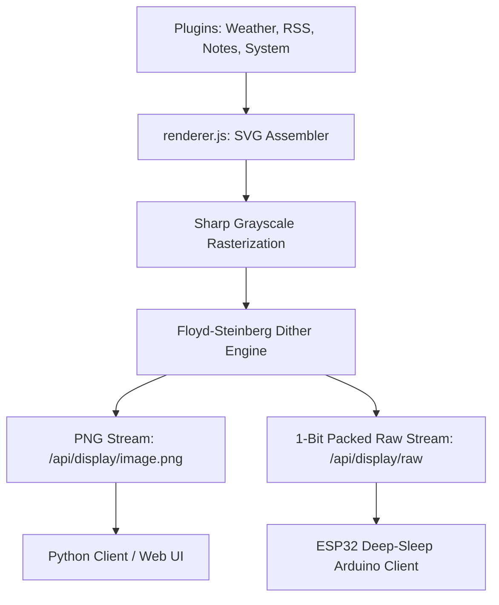

# 🚀 TRMNL Pi Server — Custom E-Ink Dashboard & OS Builder

An optimized, premium Node.js Express server that aggregates data from multiple plugins, generates responsive grid layouts, rasterizes them to grayscale, and applies high-contrast **Floyd-Steinberg dithering** for physical **E-Ink / E-Paper Displays**.

Includes a complete **automated headless Raspberry Pi OS raw image builder** utilizing user-space FUSE mounts, making setup fully plug-and-play.

---

## 🏗️ Architecture & Features



### 1. Dynamic Layout Grid
* Supports 1, 2, 3, or 4 plugins rendered in a clean grid separated by e-ink safe border dividers.
* Core plugins included:
  * **System Stats**: CPU load, memory utilization, disk usage, uptime, and temperature.
  * **Weather**: Full forecast with min/max temp, precipitation, and wind speeds using coordinates.
  * **RSS Feed**: Aggregates and displays formatted news items (default: Hacker News).
  * **Family Notice Board**: Serves custom notes, lists, or announcements.

### 2. High-Performance E-Ink Processing
* **Floyd-Steinberg Dithering**: Custom 1-bit dithering engine written with `Int16Array` error diffusion to ensure crisp shadows and readable gradients.
* **1-Bit Raw Bit-Packing**: Packs dithered pixels (8 pixels per byte, MSB-first) into a tight binary buffer suitable for lightweight transmission.
* **Ultra Low Power**: Native support for display deep sleep (using custom `X-Refresh-Rate` control headers), allowing hardware microcontrollers (like ESP32) to sleep at **~10µA current draw** and run on batteries for months.

### 3. Headless OS Raw Image Builder
* **`build_custom_image.sh`**: A shell tool that downloads Raspberry Pi OS Bookworm Lite, mounts the ext4 root filesystem headlessly using FUSE (`fuse2fs`), injects your custom server configurations, and configures a self-cleaning first-boot provisioning service.
* **No Loop Devices**: Builds raw images completely in user-space without using root loopback loop devices (`losetup`), making it fast, robust, and safe.

---

## 📁 Repository Structure

* [**`server.js`**](file:///home/derrickjevans1/trmnl-pi-server/server.js): Express web application serving API endpoints and administering configuration states.
* [**`renderer.js`**](file:///home/derrickjevans1/trmnl-pi-server/renderer.js): Core graphic engine (plugin coordinator, SVG parser, Sharp rasterizer, ditherer, and raw byte packetizer).
* [**`plugins/`**](file:///home/derrickjevans1/trmnl-pi-server/plugins): Javascript widgets performing web fetches and compiling custom e-ink SVG code.
  * [`system.js`](file:///home/derrickjevans1/trmnl-pi-server/plugins/system.js), [`weather.js`](file:///home/derrickjevans1/trmnl-pi-server/plugins/weather.js), [`rss.js`](file:///home/derrickjevans1/trmnl-pi-server/plugins/rss.js), [`notes.js`](file:///home/derrickjevans1/trmnl-pi-server/plugins/notes.js).
* [**`public/`**](file:///home/derrickjevans1/trmnl-pi-server/public): Sleek HTML5 / CSS3 local control panel to configure grid size, coordinate systems, and active widgets.
* [**`client/`**](file:///home/derrickjevans1/trmnl-pi-server/client): Python-based client supporting local mockup preview files, Pimoroni Inky series, and SPI-connected Waveshare EPD hats.
* [**`arduino/`**](file:///home/derrickjevans1/trmnl-pi-server/arduino): Optimized C++ Arduino code driving Waveshare E-Paper displays via SPI using hardware deep sleep.
* [**`build_custom_image.sh`**](file:///home/derrickjevans1/trmnl-pi-server/build_custom_image.sh): Native image packaging script using `fuse2fs`.
* [**`install.sh`**](file:///home/derrickjevans1/trmnl-pi-server/install.sh): One-click Linux server automated service setup and daemon registration.

---

## 📡 API Reference

### 1. Serving PNG Stream
* **URL**: `GET /api/display/image.png`
* **Query Parameters**:
  * `device` (default: `default_screen`): Unique device identification.
  * `force` (`true`/`false`): Bypasses memory caches to refresh immediately.
* **Response**: `image/png` binary stream.

### 2. Serving 1-Bit Packed Binary Stream
* **URL**: `GET /api/display/raw`
* **Query Parameters**:
  * `device`: Unique device identification.
  * `width`/`height`: Dimensions to compile and pack.
* **Headers**:
  * `X-Refresh-Rate`: Number of seconds the receiver should sleep before the next request.
* **Response**: `application/octet-stream` byte stream (8 pixels per byte, MSB-first, 1=white, 0=black).

### 3. TRMNL Official BYOS Protocol Endpoint
* **URL**: `GET /api/display`
* **Response**: JSON payload containing the direct absolute image URL, refresh rate, and firmware status conforming to the official TRMNL BYOS hardware requirements.

---

## 🚀 Getting Started & Setup

### Option A: Local / Native Linux Installation
If you already have a running Raspberry Pi or Linux system:
1. Clone your private repository:
   ```bash
   git clone https://github.com/DerrickJEvans/trmnl-pi-server.git
   cd trmnl-pi-server
   ```
2. Run the automated daemon installer:
   ```bash
   sudo ./install.sh
   ```
3. Open your browser and navigate to `http://<your-pi-ip>:5000` to manage your server settings!

### Option B: Build a Custom Plug-and-Play OS Image
If you want to flash a fresh SD card that boots straight into the active server headlessly:
1. Run the custom builder script:
   ```bash
   sudo ./build_custom_image.sh
   ```
2. Once complete, locate the output image `trmnl-pi-server-headless.img` in the workspace root.
3. Open **Raspberry Pi Imager** on your computer.
4. Choose **"Use custom"** OS and select the output `.img` file.
5. Click **Next** -> Choose **"Edit Settings"** to:
   * Input your Wi-Fi SSID and Password.
   * Enable SSH.
   * Set username to `derrickjevans1` and set a password.
6. Flash, insert the card into your Pi 5, power it up, and wait 3 minutes. The system will auto-install Node.js, register the background services, compile dependencies, and launch!

---

## 📟 Connecting Screens & Clients

### 1. Arduino C++ (ESP32 + Waveshare E-Paper)
Navigate to the [`arduino/`](file:///home/derrickjevans1/trmnl-pi-server/arduino) directory, open `arduino_client.ino` in the Arduino IDE, install `GxEPD2` and `Adafruit GFX`, adjust your WiFi configurations, select your exact driver chip, and upload!

### 2. Python Client (Raspberry Pi Zero / Mock Testing)
Navigate to the [`client/`](file:///home/derrickjevans1/trmnl-pi-server/client) directory, copy `config.py.example` to `config.py` (specifying target server IP, resolution, and display driver), and run:
```bash
python3 client.py
```

---

## 🛡️ License

This project is released under the [MIT License](LICENSE) (MIT). Feel free to use, fork, modify, and integrate it into your custom low-power dashboard environments!
