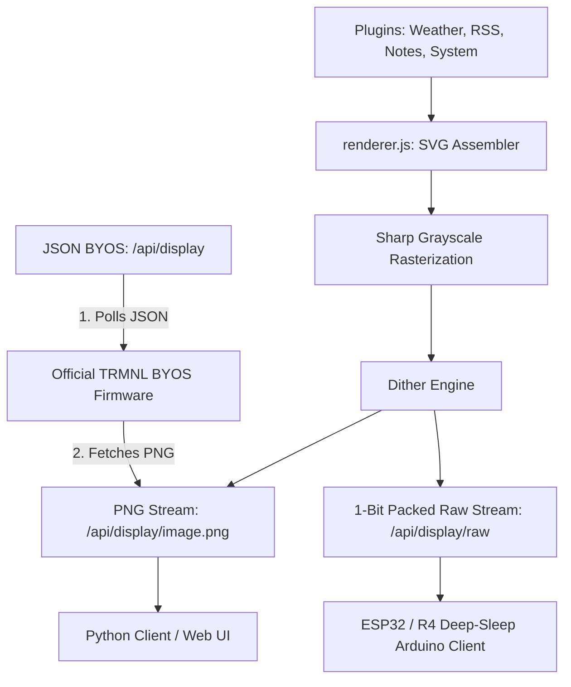

# 🚀 InkFlow E-Ink Server — Universal Custom E-Paper Dashboard Platform

An optimized, premium Node.js Express server that aggregates data from multiple plugins as beautiful SVG layouts, rasterizes them with advanced high-contrast dithering, and serves them dynamically to multiple physical **E-Ink Displays** of varying sizes.

Designed for self-hosted home LAN environments, InkFlow supports a wide variety of client screens—ranging from official TRMNL hardware to Raspberry Pi Zero standalone clients and ultra-low-power memory-constrained Arduino/ESP32 microcontrollers—allowing you to build the ultimate wireless status console.

---

## 📸 Example Client & Server Setup

The image below shows the **reTerminal E1001** running TRMNL firmware (left), **Raspberry Pi Zero 2W** running the InkFlow Python client (middle), and an **Arduino Uno R4 WiFi** running the InkFlow C++ client (right). These are all served dynamically from a single **Raspberry Pi 5 Server** (middle rear).


---

## 🏗️ Architectural Flow

InkFlow decouples high-fidelity rendering from display hardware. The server generates and rasterizes complex layouts, letting low-power clients simply fetch, draw, and sleep:


The trmnl client uses the trmnl API to fetch JSON status information which includes the image to fetch separately. 
Inkflow clients (Python and C++) fetch images in a single API call. The python client fetchs images as PNG files. The C++ client fetches the images as bitstreams for streaming to the eink driver flash memory.

---

## ✨ Core Features Showcase

### 1. Symmetrical Carousel (Rotation) Mode
Seamlessly cycle through all of your active widgets at full-screen resolution. One widget is displayed per refresh cycle, ensuring maximum legibility, large premium typography, and 0% text truncation.
* **Weather Forecast**: Open-Meteo local forecasts with daily high/low temperatures, precipitation, and wind.
* **RSS Feed**: Aggregates headlines from major presets (Tech, UK, World, HN, NYT) or a custom XML RSS feed URL.
* **Family Notice Board**: A fully interactive notice board with checklists and chores customizable inline.
* **TfL Rail Status**: Live London Underground, Overground, DLR, and Elizabeth Line disruption tracker.
* **UK Train Board**: Real-time mainline station departures and arrivals styled after authentic LED station boards.
* **System Stats**: Monitors Raspberry Pi system health (CPU load, memory, disk, uptime, temperature).
* **XKCD Comics**: Scaled comic strips fetched from the daily archive.
* **World Sun & Moon Clock**: Day/night solar and lunar maps overlaying daylight terminator curves onto dot-matrix/solid projections.
* **Daily AI Briefing**: Synthesizes custom RSS feeds and weather coordinates using Google Gemini into an elegant broadsheet.
* **AI Telemetry Advisor**: Analyzes system logs and load averages, outputting technical administrator recommendations.
* **Feynman Quotes**: Displays inspiring daily quotes from physicist Richard Feynman.

### 2. High-Performance E-Ink Processing
* **Advanced E-Paper Dithering Suite**:
  * **Floyd-Steinberg Dithering**: Custom 1-bit dithering engine written with `Int16Array` error diffusion to ensure crisp shadows and readable gradients.
  * **Atkinson Dithering**: Crisp, high-contrast dithering algorithm (classic Apple E-Ink standard) which distributes only 3/8 of quantization errors. Confining error distribution completely prevents high-frequency pixel clusters and electrical charge leakages, avoiding the common "faded" look on physical panels.
  * **Thresholded Dot-Matrix / Solid Outline (`dots` / `solid` / `none`)**: Bypasses dithering to perform pure mathematical thresholding, resulting in perfectly crisp black-and-white vectors.
* **1-Bit Raw Bit-Packing**: Packs dithered pixels (8 pixels per byte, MSB-first) into a tight binary buffer suitable for lightweight transmission on memory-constrained microcontrollers.
* **Color Inversion**: Easily toggle between `Standard (Black on White)` or `Inverted (White on Black)` rendering in your device settings to flip the contrast dynamically on the fly.
* **Ultra Low Power**: Native support for display deep sleep (using custom `X-Refresh-Rate` control headers), allowing hardware microcontrollers (like ESP32) to sleep at **~10µA current draw** and run on batteries for months.

### 3. Premium Glassmorphic Web Control Center
* **Device Console**: Real-time server telemetry dashboard (CPU, temperature, RAM gauges) docked in a glassmorphic horizontal bar. Auto-discovered screen device lists and live dithered e-paper mockup bezels align side-by-side cleanly to optimize spacing.
* **Timeline Carousel Drawer**: Form controls and drag-and-drop rotation sequence timeline expand horizontally at the bottom of the console, giving you maximum width to reorder and calibrate display rotation cycles.
* **AI Plugin Studio**: Each plugin card in the catalog houses its own config template. Form fields open inline with smooth glass slide animations. Saving options compiles a Floyd-Steinberg dithered preview directly on a separate mockup frame, leaving active device cycles un-interrupted.

---

## 🏁 Quick Navigation

To make deploying and using InkFlow as simple as possible, use the links below to jump directly to your chosen setup path:

1. [**🖥️ Step 1: Deploy the Server (Docker or Bare-Metal)**](#-step-1-server-deployment)
2. [**📟 Step 2: Set Up Your Client Screens**](#-step-2-client-screen-setup)
   - [Option A: Headless OS Image (Automatic Firstboot Setup)](#option-a-headless-os-image-automatic-firstboot-setup)
   - [Option B: Pi Python Client (Pimoroni/Waveshare Hat Setup)](#option-b-pi-python-client-pimoroniwaveshare-epd-setup)
   - [Option C: Arduino & ESP32 Microcontrollers (Battery Powered)](#option-c-arduino--esp32-microcontrollers-ultra-low-power)
3. [**🛠️ Step 3: Manage Your Environment (Dashboard & CLI)**](#%EF%B8%8F-master-control-utilities)
4. [**🧠 Step 4: Configure AI Integration (Gemini, Groq, Ollama)**](#-hybrid-multi-provider-ai-integration)
5. [**📡 Developer API Reference (Endpoints & JSON BYOS)**](#-api-reference--protocol-specification)

---

## 🖥️ Step 1: Server Deployment

First, deploy the central InkFlow server on a server host (such as a Raspberry Pi 5 or an Ubuntu Home Server). This server handles rendering and layout management.

> [!NOTE]
> The GitHub repository is **public**. All clone, checkout, and installation commands run seamlessly without needing any GitHub Personal Access Tokens (PATs) or passwords.

### Option A: Multi-Container Docker Setup (Recommended)
This approach spins up the main InkFlow Node.js server alongside a local, dedicated Ollama AI instance with a single command. It requires zero package managers, compilers, or local dependencies.

1. Clone the repository and navigate into the project directory:
   ```bash
   git clone https://github.com/DerrickJEvans/inkflow-eink.git
   cd inkflow-eink
   ```
2. Build and launch the container stack in the background:
   ```bash
   docker compose up -d --build
   ```
   * *This automatically maps host caches persistently, exposes the central web interface on port **`5000`**, and spawns Ollama in a secure internal bridge network.*

---

### Option B: Native Bare-Metal Host Installation
Best if you prefer running natively directly on your Raspberry Pi OS or Ubuntu machine.

1. Clone the repository and navigate into the project directory:
   ```bash
   git clone https://github.com/DerrickJEvans/inkflow-eink.git
   cd inkflow-eink
   ```
2. Make the installer script executable and run it:
   ```bash
   sudo chmod +x install.sh
   sudo ./install.sh
   ```
   * *This automated installer installs Node.js packages, compiles dependency engines, registers a native local Ollama system service, fetches the local `llama3.2:1b` model, and binds the central `inkflow-eink.service` system daemon to automatically start on boot.*

---

## 📟 Step 2: Client Screen Setup

Once the server is running, configure your physical displays to retrieve rendered dashboards. Choose the path matching your display hardware:

---

### Option A: Headless OS Image (Automatic Firstboot Setup)
*For a plug-and-play experience, flash a preconfigured OS image onto your client micro-SD card. It resizes itself and connects to your server automatically on boot.*

> [!WARNING]
> **64-Bit OS Image Requirement**: The custom pre-built OS image is compiled for 64-bit architectures (`arm64`). It is **incompatible** with first-generation Raspberry Pi Zero W (v1.1 / v1.3) hardware, which uses a 32-bit ARMv6 CPU. 
> 
> If you are using an older 32-bit Pi Zero W, please skip this option and use **[Option B: Pi Python Client](#option-b-pi-python-client-pimoroniwaveshare-epd-setup)** instead, running on a standard 32-bit Raspberry Pi OS Lite image.


1. **Flash Your SD Card**: Download the custom `inkflow.img.xz` OS image and its accompanying `inkflow-imager-repo.json` index from the **[GitHub Releases](https://github.com/DerrickJEvans/inkflow-eink/releases)** page.
   * To load the custom OS category into **Raspberry Pi Imager**, run it from your command line pointing to the downloaded JSON file:
     * **PowerShell**:
       ```powershell
       & "C:\Program Files\Raspberry Pi Ltd\Imager\rpi-imager.exe" --repo "C:\path\to\inkflow-imager-repo.json"
       ```
     * **Windows Command Prompt (CMD)**:
       ```cmd
       "C:\Program Files\Raspberry Pi Ltd\Imager\rpi-imager.exe" --repo "C:\path\to\inkflow-imager-repo.json"
       ```
     * **Linux Bash**:
       ```bash
       rpi-imager --repo /path/to/inkflow-imager-repo.json
       ```
   * Select the **Inkflow OS** -> **Inkflow Headless OS** option, select your target SD card, configure your Wi-Fi SSID and login details within the Imager settings dialog, and flash!
 2. **Edit Boot Configuration**: Once flashing is complete, do not boot yet. Insert the SD card back into your computer and open its FAT boot partition. Open the text file named **`inkflow-setup.txt`** to configure the device's role.
    * *By default, the image is set up to act as a **Server** (`ROLE=server` is active, and client lines are commented out).*
    * **To configure a Client**, comment out the server section and uncomment the client section (remove the `#` prefix) to fill out your details:
      ```ini
      # SERVER MODE (Comment out if configuring a Client)
      # ROLE=server
      # DEVICE_NAME=Living Room Pi

      # CLIENT MODE (Uncomment and configure)
      ROLE=client
      SERVER_IP=192.168.1.100    # Point this to your Raspberry Pi 5 Server IP
      SCREEN_TYPE=4in26           # Options: '4in26', '7in5', '4in2', '2in9'
      DEVICE_NAME=Kitchen E-Ink  # Friendly label for your control panel
      ```
 3. **Boot and Connect**: Insert the SD card into your client Pi (e.g., Pi Zero 2W) and power it on. The filesystem expands instantly, registers systemd display drivers, and pulls E-Ink frames from the server automatically within moments!

> [!NOTE]
> **Filesystem Installation Location**: Unlike standard user accounts that begin with an empty home directory, the automated bootstrap installer places the entire codebase under `/opt/trmnl-pi-server`. 
> 
> To manage files, view settings, or execute utilities, navigate there after logging in:
> ```bash
> cd /opt/trmnl-pi-server
> ```

---

### Option B: Pi Python Client (Pimoroni/Waveshare EPD Setup)
*Ideal if you are running a standard Raspberry Pi OS on a Pi Zero/Zero 2W with an attached Waveshare or Pimoroni SPI E-Paper Hat.*

1. **Enable SPI Bus**: Connect to your client Pi via SSH and enable the hardware SPI interface:
   ```bash
   sudo raspi-config
   # Choose 'Interface Options' -> 'SPI' -> 'Enable (Yes)' -> 'Finish' & Reboot.
   ```
2. **Pristine Sparse Checkout**:
   To download *only* the client folder without any server-side dependencies, run this highly efficient sparse checkout:
   ```bash
   sudo apt update && sudo apt install -y git
   mkdir -p ~/inkflow-client && cd ~/inkflow-client
   git init
   git remote add origin https://github.com/DerrickJEvans/inkflow-eink.git
   git config core.sparseCheckout true
   echo 'client/*' >> .git/info/sparse-checkout
   git pull origin main
   ```
3. **Run the Interactive Client Script**:
   ```bash
   cd ~/inkflow-client/client
   chmod +x inkflow-client.sh
   ./inkflow-client.sh
   ```
   * **Select Option `[1]` (Run Automated Client Setup/Installer)**.
   * **Interactive Setup**: The script will guide you through entering your **Server IP/Host**, **Friendly Device Name**, and selecting your display model (`4in26`, `7in5`, `4in2`, `2in9`) from an easy option list.
   * *The installer updates system packages, performs a memory-safe partial installation of native display libraries, writes clean variables to a secure `.env` file, and establishes the auto-starting `inkflow-client.service` daemon.*

---

### Option C: Arduino & ESP32 Microcontrollers (Ultra-Low Power)
*Ideal for battery-operated e-paper devices running on microcontrollers like the ESP32 or Arduino Uno R4 WiFi + Waveshare SPI shield.*

1. Open the Arduino IDE and load the source files from the [**`arduino/`**](arduino) directory (choose `arduino_client.ino` for ESP32 or `arduino_r4_client.ino` for UNO R4).
2. Open `config.h` to choose your target display dimensions, compile, and upload the sketch to your board.
3. **Captive WiFi Setup Portal**:
   * Once booted, the device hosts its own network. Connect your phone or computer to the Access Point:
     * **ESP32 AP**: `InkFlow-Setup` (Open network)
     * **Arduino UNO R4 AP**: `InkFlow-R4-Setup` (WPA2 password: `12345678`)
   * A captive setup window will open automatically. Choose your home Wi-Fi SSID, enter the password, specify your **InkFlow Server IP** and Port, and click **Save Settings & Connect**!
4. **Offline Diagnostics**:
   * If the Wi-Fi connection fails or the server is unreachable, the display draws a beautiful visual diagnostic card showing current network info, target IP port, and connection errors, making debugging easy without serial monitor cables.

---

## 🛠️ Master Control Utilities

Manage your client and server configurations easily using the elegant interactive shell panels or quick CLI commands.

### 1. Server CLI Utility (`./inkflow.sh`)
Execute commands from the project root directory on your server:
* **`./inkflow.sh`** (Run without arguments to launch the interactive, colorful server dashboard console)
* **`./inkflow.sh start` / `stop` / `restart`**: Control the background Node.js server systemd daemons.
* **`./inkflow.sh logs`**: Stream server console outputs and plugin generation reports in real time.
* **`./inkflow.sh status`**: Perform a deep system scan, validating port bindings, disk states, local Ollama models, and connected screens.
* **`./inkflow.sh update`**: Backs up current files, updates from Git, rebuilds dependencies, and performs clean system restarts.

### 2. Client CLI Utility (`./inkflow-client.sh`)
Execute commands from the `/client` directory on your display client:
* **`./inkflow-client.sh`** (Run without arguments to open the visual client menu console)
* **`./inkflow-client.sh start` / `stop` / `restart`**: Manage background Python rendering processes.
* **`./inkflow-client.sh logs`**: Stream EPD refresh intervals, connection codes, and SPI bus activities.
* **`./inkflow-client.sh status`**: Scan SPI status, verify `.env` settings, ping the host server, and display MAC address and Wi-Fi signal strength (RSSI).
* **`./inkflow-client.sh update`**: Updates local display drivers, fetches clean client updates, and restarts services.

---

## 🧠 Hybrid Multi-Provider AI Integration

InkFlow blends local offline LLMs with cloud-based AI to provide intelligent, low-latency, and zero-cost dashboard widgets.

### 1. ✨ Dynamic AI Widget Studio
Instruct the AI in plain English to build a custom widget (e.g. *"Create a stock market tracker for Apple and Tesla with dithered layout blocks"*). 
* **Zero Restart Hot-Reloads**: The server compiles, registers, and loads the generated JavaScript code on the fly without rebooting.
* **Dynamic Credentials UI**: If the plugin requires an API key or password, the AI structures it in the plugin schema. The web control panel automatically builds masked form fields and persists them safely in `config.json`.
* **One-Click Pruning**: Deleting a generated widget instantly deletes its code file, unloads it from memory, and scrubs its presence from all carousel queues and dither caches.

### 2. 🎛️ Intelligent Multi-Engine Routing
Combine powerful cloud models with local offline services to eliminate ongoing costs:
* **Widget Generation (Reasoning)**: Route schema generation to cloud models (like Gemini Pro) for advanced code reasoning.
* **Daily Telemetry & Content Generation**: Route daily RSS summaries and morning briefings to a free local Ollama instance running offline.

#### Example Configuration (`.env`):
```env
# Cloud Gemini Pro configuration for complex code generation
GEMINI_API_KEY=AIzaSyYourActualKeyHere
WIDGET_BUILDER_AI_PROVIDER=gemini

# Local Ollama configuration for daily routines and telemetry audits
OLLAMA_ENABLED=true
DYNAMIC_WIDGETS_AI_PROVIDER=ollama
```

---

## 📡 API Reference & Protocol Specification

InkFlow exposes standardized endpoints for easy integration with custom scripts or physical e-paper displays:

### 1. Retrieve PNG Display Stream
* **Endpoint**: `GET /api/display/image.png`
* **Query Parameters**:
  * `device` (default: `default_screen`): Unique device identification string.
  * `force` (`true`/`false`): Bypasses local RAM caches to refresh layout components immediately.
* **Returns**: `image/png` binary image stream.

### 2. Retrieve 1-Bit Packed Binary Stream (Microcontroller Native)
* **Endpoint**: `GET /api/display/raw`
* **Query Parameters**:
  * `device`: Unique device identification string.
  * `width`/`height`: Pixels to pack.
* **Headers Returned**:
  * `X-Refresh-Rate`: Number of seconds the controller should sleep before fetching the next frame.
* **Returns**: `application/octet-stream` byte stream (8 pixels per byte, MSB-first, 1=white, 0=black).

### 3. TRMNL Official BYOS Protocol Endpoint
* **Endpoint**: `GET /api/display`
* **Incoming Headers**:
  * `ID`: Hardware MAC address (e.g., `DC:B4:D9:0E:B6:F8`)
* **Returns**: Conforms perfectly to official TRMNL BYOS hardware requirements:
  ```json
  {
    "status": 0,
    "image_url": "http://[server-ip]:5000/api/display/image.png?device=[device-id]",
    "filename": "screen-[device-id]-[timestamp].png",
    "image_name": "screen-[device-id]-[timestamp].png",
    "update_firmware": false,
    "firmware_url": null,
    "refresh_rate": 1800,
    "reset_firmware": false
  }
  ```
  > [!IMPORTANT]
  > Under the TRMNL BYOS protocol, the `status` field must be set to `0` inside the JSON body to indicate success. A status code of `200` or standard HTTP success codes inside the JSON body will be rejected by the device's firmware as an error, causing it to retry immediately without downloading the E-Ink display image.

---

## 📁 Repository Map

* [**`server.js`**](server.js): Main Express server hosting API endpoints and managing system settings.
* [**`renderer.js`**](renderer.js): Graphic rendering engine handling SVG construction, Sharp rasterization, and dithering.
* [**`plugins/`**](plugins): Widgets that fetch remote data and build dither-ready SVG layouts.
  * **Core**: [`system.js`](plugins/system.js), [`weather.js`](plugins/weather.js), [`rss.js`](plugins/rss.js), [`notes.js`](plugins/notes.js), [`tfl.js`](plugins/tfl.js), [`uk_trains.js`](plugins/uk_trains.js), [`xkcd.js`](plugins/xkcd.js), [`world_clock.js`](plugins/world_clock.js), [`feynman_quote.js`](plugins/feynman_quote.js).
  * **AI Powered**: [`ai_briefing.js`](plugins/ai_briefing.js), [`ai_advisor.js`](plugins/ai_advisor.js).
* [**`public/`**](public): Glassmorphic web control panel to manage settings, widgets, and view real-time screen previews.
* [**`client/`**](client): Python client code for Raspberry Pi devices with attached E-Paper screens.
* [**`arduino/`**](arduino): Lightweight C++ sketches for Arduino and ESP32 microcontrollers.
* [**`install.sh`**](install.sh): One-click server installer for Ubuntu or Raspberry Pi OS host systems.
* [**`inkflow.sh`**](inkflow.sh): Master server control utility and diagnostic system.
* [**`client/inkflow-client.sh`**](client/inkflow-client.sh): Master client control panel and automatic SPI installer.

---

## 🛡️ License

This project is licensed under the [MIT License](LICENSE) (MIT). Feel free to use, modify, and distribute it in your custom low-power dashboard environments!
