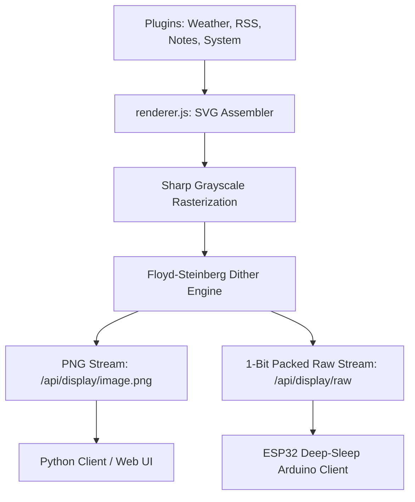

# 🚀 TRMNL Pi Server — Custom E-Ink Dashboard & OS Builder

An optimized, premium Node.js Express server that aggregates data from multiple plugins, generates responsive grid layouts, rasterizes them to grayscale, and applies high-contrast **Floyd-Steinberg dithering** for physical **E-Ink / E-Paper Displays**.

Includes a complete **automated headless Raspberry Pi OS raw image builder** utilizing user-space FUSE mounts, making setup fully plug-and-play.

---

## 🏗️ Architecture & Features



### 1. Dynamic Layout Grid
* Supports 1, 2, 3, or 4 plugins rendered in a clean grid separated by e-ink safe border dividers.
* Core plugins included:
  * **System Stats**: CPU load, memory utilization, disk usage, uptime, and temperature.
  * **Weather**: Full forecast with min/max temp, precipitation, and wind speeds using coordinates.
  * **RSS Feed**: Aggregates and displays formatted news items (default: Hacker News).
  * **Family Notice Board**: Serves custom notes, lists, or announcements.

### 2. High-Performance E-Ink Processing
* **Floyd-Steinberg Dithering**: Custom 1-bit dithering engine written with `Int16Array` error diffusion to ensure crisp shadows and readable gradients.
* **1-Bit Raw Bit-Packing**: Packs dithered pixels (8 pixels per byte, MSB-first) into a tight binary buffer suitable for lightweight transmission.
* **Ultra Low Power**: Native support for display deep sleep (using custom `X-Refresh-Rate` control headers), allowing hardware microcontrollers (like ESP32) to sleep at **~10µA current draw** and run on batteries for months.

### 3. Headless OS Raw Image Builder
* **`build_custom_image.sh`**: A shell tool that downloads Raspberry Pi OS Bookworm Lite, mounts the ext4 root filesystem headlessly using FUSE (`fuse2fs`), injects your custom server configurations, and configures a self-cleaning first-boot provisioning service.
* **No Loop Devices**: Builds raw images completely in user-space without using root loopback loop devices (`losetup`), making it fast, robust, and safe.

---

## 📁 Repository Structure

* [**`server.js`**](file:///home/derrickjevans1/trmnl-pi-server/server.js): Express web application serving API endpoints and administering configuration states.
* [**`renderer.js`**](file:///home/derrickjevans1/trmnl-pi-server/renderer.js): Core graphic engine (plugin coordinator, SVG parser, Sharp rasterizer, ditherer, and raw byte packetizer).
* [**`plugins/`**](file:///home/derrickjevans1/trmnl-pi-server/plugins): Javascript widgets performing web fetches and compiling custom e-ink SVG code.
  * [`system.js`](file:///home/derrickjevans1/trmnl-pi-server/plugins/system.js), [`weather.js`](file:///home/derrickjevans1/trmnl-pi-server/plugins/weather.js), [`rss.js`](file:///home/derrickjevans1/trmnl-pi-server/plugins/rss.js), [`notes.js`](file:///home/derrickjevans1/trmnl-pi-server/plugins/notes.js).
* [**`public/`**](file:///home/derrickjevans1/trmnl-pi-server/public): Sleek HTML5 / CSS3 local control panel to configure grid size, coordinate systems, and active widgets.
* [**`client/`**](file:///home/derrickjevans1/trmnl-pi-server/client): Python-based client supporting local mockup preview files, Pimoroni Inky series, and SPI-connected Waveshare EPD hats.
* [**`arduino/`**](file:///home/derrickjevans1/trmnl-pi-server/arduino): Optimized C++ Arduino code driving Waveshare E-Paper displays via SPI using hardware deep sleep.
* [**`build_custom_image.sh`**](file:///home/derrickjevans1/trmnl-pi-server/build_custom_image.sh): Native image packaging script using `fuse2fs`.
* [**`install.sh`**](file:///home/derrickjevans1/trmnl-pi-server/install.sh): One-click Linux server automated service setup and daemon registration.

---

## 📡 API Reference

### 1. Serving PNG Stream
* **URL**: `GET /api/display/image.png`
* **Query Parameters**:
  * `device` (default: `default_screen`): Unique device identification.
  * `force` (`true`/`false`): Bypasses memory caches to refresh immediately.
* **Response**: `image/png` binary stream.

### 2. Serving 1-Bit Packed Binary Stream
* **URL**: `GET /api/display/raw`
* **Query Parameters**:
  * `device`: Unique device identification.
  * `width`/`height`: Dimensions to compile and pack.
* **Headers**:
  * `X-Refresh-Rate`: Number of seconds the receiver should sleep before the next request.
* **Response**: `application/octet-stream` byte stream (8 pixels per byte, MSB-first, 1=white, 0=black).

### 3. TRMNL Official BYOS Protocol Endpoint
* **URL**: `GET /api/display`
* **Response**: JSON payload containing the direct absolute image URL, refresh rate, and firmware status conforming to the official TRMNL BYOS hardware requirements.

---

## 🚀 Getting Started & Setup

### Option A: Headless Native Local Network Installation (Highly Recommended)
This is the **most robust and reliable method** for setting up your Raspberry Pi 5. It uses the official uncorrupted Raspberry Pi OS Lite, flashes it via the Imager, and copies your exact local workspace files directly over your home Wi-Fi using built-in Windows OpenSSH (`scp`).

#### 1. Flash a Fresh Official OS
* Open **Raspberry Pi Imager** normally on Windows.
* **Choose Device**: Select **Raspberry Pi 5**.
* **Choose OS**: Navigate to **Raspberry Pi OS (other)** -> Select **Raspberry Pi OS Lite (64-bit)** (clean, official headless OS).
* **Choose Storage**: Select your SD card.
* Click **Next** -> Click **EDIT SETTINGS**:
  * **General**: Set Username to `derrickjevans1`, set a password, and configure your **Wi-Fi** SSID and Password.
  * **Services**: Check **Enable SSH** (using password authentication).
* Click **Save** and write the image to your SD card. Insert the card into your Pi 5 and power it up.

#### 2. Pack & Copy Files from Windows (via PowerShell)
Open **PowerShell** on your Windows PC and run these commands to compress your workspace (excluding massive Windows `node_modules` and images) and copy it directly to the Pi:
```powershell
# cd into your workspace folder
cd "C:\Users\derri\.gemini\antigravity\scratch\trmnl-pi-server"

# Pack workspace into a lightweight archive in the parent directory
tar -czf ..\trmnl-pi-server.tar.gz --exclude="node_modules" --exclude="*.img" --exclude="*.xz" .

# Transfer the archive to the Pi (replace <IP-ADDRESS> with your Pi's IP address)
scp ..\trmnl-pi-server.tar.gz derrickjevans1@<IP-ADDRESS>:/home/derrickjevans1/

# Delete the temporary local archive
Remove-Item ..\trmnl-pi-server.tar.gz
```
*(Tip: If `ssh` blocks the connection with a "host identification has changed" warning because you flashed a new OS, clear it with `ssh-keygen -R <IP-ADDRESS>` first).*

#### 3. Extract and Install Natively on the Pi
Connect to your Pi 5 via SSH and run the native installer to compile everything natively for the Pi's arm64 architecture:
```bash
# SSH into the Pi
ssh derrickjevans1@<IP-ADDRESS>

# Extract the package
mkdir -p ~/trmnl-pi-server
tar -xzf trmnl-pi-server.tar.gz -C ~/trmnl-pi-server
cd ~/trmnl-pi-server

# Strip Windows line endings and run the native automated installer
sed -i 's/\r$//' *.sh
chmod +x install.sh
sudo ./install.sh
```
Once the installer completes, the server will be running persistently in the background. Open your browser and navigate to `http://<your-pi-ip>:5000` to manage your server!

---

### Option B: Build a Custom Plug-and-Play OS Image (Advanced)
If you want to build a raw custom `.img` file that can be flashed straight to an SD card:

#### 1. Run the Image Builder (inside WSL Ubuntu)
To ensure high-performance native partition loopback mounting, run the builder in WSL's local home folder:
```bash
# Sync files to WSL
wsl mkdir -p ~/trmnl-pi-server
wsl rsync -a --exclude="node_modules" --exclude="*.img" --exclude="*.xz" /mnt/c/Users/derri/.gemini/antigravity/scratch/trmnl-pi-server/ ~/trmnl-pi-server/

# Normalize line endings and run as root to mount loop offsets natively
wsl -u root -d Ubuntu -e bash -c "sed -i 's/\r$//' /home/derrick/trmnl-pi-server/*.sh"
wsl -u root -d Ubuntu -e bash -c "cd /home/derrick/trmnl-pi-server && ./build_custom_image.sh"

# Copy the finished image (2.7 GB) back to Windows and clean up WSL
wsl cp /home/derrick/trmnl-pi-server/trmnl-pi-server-headless.img /mnt/c/Users/derri/.gemini/antigravity/scratch/trmnl-pi-server/
wsl rm -rf /home/derrick/trmnl-pi-server
```

#### 2. Flash via Imager with OS Customizations Enabled
To unlock Raspberry Pi Imager's hidden **OS Customization (Edit Settings)** menu for a custom `.img` file, you must launch the Imager pointing to the custom local repository JSON file we created (`trmnl-imager-repo.json`):

Run this command in Windows Command Prompt (CMD) or PowerShell:
```cmd
"C:\Program Files\Raspberry Pi Ltd\Imager\rpi-imager.exe" --repo "C:\Users\derri\.gemini\antigravity\scratch\trmnl-pi-server\trmnl-imager-repo.json"
```
* **Choose Device**: Select **Raspberry Pi 5**.
* **Choose OS**: Select **TRMNL Pi Server OS** -> **TRMNL Pi Headless Server**.
* **Choose Storage**: Select your SD card.
* Click **Next** -> The **"Apply OS customization settings"** window will now be successfully unlocked! Select **Edit Settings** to configure your Wi-Fi, SSH, and set your username to `derrickjevans1`.
* Flash, insert the card into your Pi 5, power it up, and wait 3 minutes for native first-boot provisioning!

---

## 📟 Connecting Screens & Clients

### 1. Arduino C++ (ESP32 + Waveshare E-Paper)
Navigate to the [`arduino/`](file:///home/derrickjevans1/trmnl-pi-server/arduino) directory, open `arduino_client.ino` in the Arduino IDE, install `GxEPD2` and `Adafruit GFX`, adjust your WiFi configurations, select your exact driver chip, and upload!

### 2. Python Client (Raspberry Pi Zero 2 W + Waveshare 4.26" 800x480 Display)
Designed to run on a headless Raspberry Pi Zero 2 W equipped with a **Waveshare E-Paper Driver HAT Rev 2.3** and a **4.26" e-Paper Display (800x480)**.

#### 1. Assembly & Hardware Setup
* Plug the **Waveshare E-Paper Driver HAT Rev 2.3** directly onto the Pi Zero 2 W's 40-pin GPIO header.
* Connect the **4.26" e-Paper panel** to the HAT using the flat ribbon cable (FFC) via the GH1.25 9-pin connector. Make sure pins face down and the black latch is firmly locked.
* Boot a clean **Raspberry Pi OS Lite (64-bit)** card flashed with Imager (enabling SSH & Wi-Fi in the custom settings).

#### 2. OS SPI Configuration
Connect to the Pi Zero 2 W via SSH and enable the hardware SPI bus:
```bash
sudo raspi-config
# Select 'Interface Options' -> 'SPI' -> 'Enable (Yes)' -> 'Finish' & Reboot.
```

#### 3. Install System Dependencies & Drivers
After the Pi reboots, log back in and run:
```bash
sudo apt-get update
sudo apt-get install -y python3-pip python3-pil python3-numpy git

# Install the official Waveshare Python E-Paper driver package globally
sudo pip3 install "git+https://github.com/waveshare/e-Paper.git#egg=waveshare-epd&subdirectory=RaspberryPi_JetsonNano/python" --break-system-packages
```

#### 4. Transfer & Configure the Client Code
From your Windows PC's PowerShell, copy the `client` directory using SCP:
```powershell
scp -r "C:\Users\derri\.gemini\antigravity\scratch\trmnl-pi-server\client" derrickjevans1@<pi-zero-ip>:/home/derrickjevans1/
```
*(On the Pi Zero 2 W, `client/config.py` is pre-configured with the driver `epd4in26`, resolution `800x480`, and target server IP `192.168.1.122` on port `5000`)*

#### 5. Verify & Run
SSH into the Pi Zero 2 W and run manually to test:
```bash
cd ~/client
python3 client.py
```
*The client will connect to your Pi 5 server, auto-register as `pi_zero_4in26`, dither the image, and render it onto the physical screen!*

#### 6. Register as an Automatic Boot Service
To keep the client running indefinitely in the background and survive reboots:
```bash
# Create systemd service definition
sudo nano /etc/systemd/system/trmnl-client.service
```
Paste this configuration:
```ini
[Unit]
Description=TRMNL E-Ink Display Client
After=network-online.target
Wants=network-online.target

[Service]
Type=simple
User=derrickjevans1
WorkingDirectory=/home/derrickjevans1/client
ExecStart=/usr/bin/python3 /home/derrickjevans1/client/client.py
Restart=always
RestartSec=15
StandardOutput=syslog
StandardError=syslog
SyslogIdentifier=trmnl-client

[Install]
WantedBy=multi-user.target
```
Enable and start the background service:
```bash
sudo systemctl daemon-reload
sudo systemctl enable trmnl-client.service
sudo systemctl start trmnl-client.service
```
Check real-time activity logs:
```bash
journalctl -u trmnl-client.service -f -n 50
```


---

## 🛡️ License

This project is released under the [MIT License](LICENSE) (MIT). Feel free to use, fork, modify, and integrate it into your custom low-power dashboard environments!
