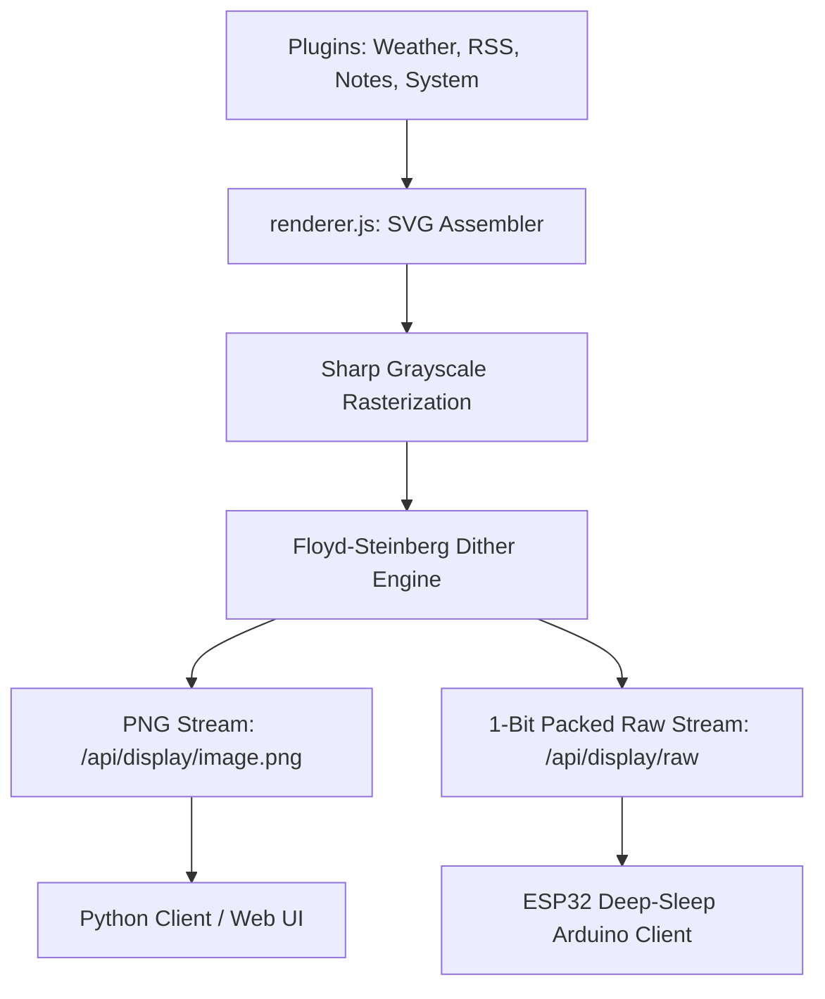

# 🚀 InkFlow E-Ink Server — Custom Dashboard & OS Builder

An optimized, premium Node.js Express server that aggregates data from multiple plugins, compiles them into responsive full-screen carousel cycles, rasterizes them to grayscale, and applies high-contrast **Floyd-Steinberg dithering** for physical **E-Ink / E-Paper Displays**.

Includes a complete **automated headless Raspberry Pi OS raw image builder** utilizing user-space FUSE mounts, making setup fully plug-and-play.

---

## 🏗️ Architecture & Features



### 1. Symmetrical Carousel (Rotation) Mode
* Seamlessly cycles through all of your active widgets at full-screen resolution. Displays one widget per refresh cycle, ensuring maximum legibility, large premium typography, and 0% text truncation!
* Core plugins included:
  * **System Stats**: Monitors Raspberry Pi system health (CPU load, memory, disk utilization, uptime, temperature).
  * **Weather Forecast**: Open-Meteo local weather forecasts with daily high/low temperatures, precipitation, and wind.
  * **RSS Feed**: Aggregates headlines from major presets (Tech, UK, World, HN, NYT) or a custom XML RSS feed url.
  * **Family Notice Board**: A fully interactive notice board with checklists and chores customizable inline.
  * **TfL Rail Status**: Live London Underground, Overground, DLR, and Elizabeth Line disruption tracker.
  * **UK Train Board**: Real-time mainline station departures and arrivals styled after authentic LED station boards.
  * **XKCD Comics**: Scaled comic strips fetched from the daily archive.
  * **World Sun & Moon Clock**: Day/night solar and lunar maps overlaying daylight terminator curves onto dot-matrix/solid projections.
  * **Daily AI Briefing**: Synthesizes custom RSS feeds and weather coordinates using Google Gemini into an elegant broadsheet.
  * **AI Telemetry Advisor**: Analyzes system logs and load averages, outputting technical administrator recommendations.
  * **AI Widget Builder**: Hot-loads natural language descriptions into verified Javascript display plugins on-the-fly.
  * **Feynman Quotes**: Displays inspiring daily quotes from physicist Richard Feynman.

### 2. High-Performance E-Ink Processing
* **Floyd-Steinberg Dithering**: Custom 1-bit dithering engine written with `Int16Array` error diffusion to ensure crisp shadows and readable gradients.
* **1-Bit Raw Bit-Packing**: Packs dithered pixels (8 pixels per byte, MSB-first) into a tight binary buffer suitable for lightweight transmission.
* **Ultra Low Power**: Native support for display deep sleep (using custom `X-Refresh-Rate` control headers), allowing hardware microcontrollers (like ESP32) to sleep at **~10µA current draw** and run on batteries for months.

### 3. 🎨 Premium Glassmorphic Web Control Center
* **Three-Tab Interface**: Separates day-to-day E-Ink management (**Device Console**), custom plugin coding (**AI Studio**), and system keys/local hardware settings (**AI & Ollama Admin**).
* **Restructured Device Console**:
  * **Pi Host Metrics Banner**: Real-time server telemetry dashboard (CPU circle chart, temperature, RAM gauges) is docked in a horizontal bar spanning full-width across the top of the console.
  * **Multi-Column Alignment**: Auto-discovered screen device lists and live dithered e-paper mockup bezels align side-by-side cleanly to optimize spacing.
  * **Spacious bottom settings drawer**: Form controls and the drag-and-drop rotation sequence timeline expand horizontally, giving you maximum width to reorder and calibrate display rotation cycles.
* **AI Studio & Embedded Configurations**:
  * **In-Tile Forms**: Obsolete sidebar accordions are removed; each plugin card in the catalog houses its own config template. Form fields open inline with smooth glass slide animations.
  * **Event Propagation Safety Blocks**: Text inputs, checkboxes, and notice additions intercept mousedown events to prevent catalog re-selections or preview restarts while typing.
  * **Dedicated AI Preview Bezel**: Saving inline options compiles a Floyd-Steinberg dithered preview directly on a separate mockup frame, leaving active device cycles un-interrupted.

### 4. Headless OS Raw Image Builder
* **`build_custom_image.sh`**: A shell tool that downloads Raspberry Pi OS Bookworm Lite, mounts the ext4 root filesystem headlessly using FUSE (`fuse2fs`), injects your custom server configurations, and configures a self-cleaning first-boot provisioning service.
* **No Loop Devices**: Builds raw images completely in user-space without using root loopback loop devices (`losetup`), making it fast, robust, and safe.

---

## 📁 Repository Structure

* [**`server.js`**](file:///home/derrickjevans1/trmnl-pi-server/server.js): Express web application serving API endpoints and administering configuration states.
* [**`renderer.js`**](file:///home/derrickjevans1/trmnl-pi-server/renderer.js): Core graphic engine (plugin coordinator, SVG parser, Sharp rasterizer, ditherer, and raw byte packetizer).
* [**`plugins/`**](file:///home/derrickjevans1/trmnl-pi-server/plugins): Javascript widgets performing web fetches and compiling custom e-ink SVG code.
  * Core: [`system.js`](file:///home/derrickjevans1/trmnl-pi-server/plugins/system.js), [`weather.js`](file:///home/derrickjevans1/trmnl-pi-server/plugins/weather.js), [`rss.js`](file:///home/derrickjevans1/trmnl-pi-server/plugins/rss.js), [`notes.js`](file:///home/derrickjevans1/trmnl-pi-server/plugins/notes.js), [`tfl.js`](file:///home/derrickjevans1/trmnl-pi-server/plugins/tfl.js), [`uk_trains.js`](file:///home/derrickjevans1/trmnl-pi-server/plugins/uk_trains.js), [`xkcd.js`](file:///home/derrickjevans1/trmnl-pi-server/plugins/xkcd.js), [`world_clock.js`](file:///home/derrickjevans1/trmnl-pi-server/plugins/world_clock.js), [`feynman_quote.js`](file:///home/derrickjevans1/trmnl-pi-server/plugins/feynman_quote.js), [`airport_board.js`](file:///home/derrickjevans1/trmnl-pi-server/plugins/airport_board.js), [`tide_timetable.js`](file:///home/derrickjevans1/trmnl-pi-server/plugins/tide_timetable.js).
  * Gemini AI: [`ai_briefing.js`](file:///home/derrickjevans1/trmnl-pi-server/plugins/ai_briefing.js), [`ai_advisor.js`](file:///home/derrickjevans1/trmnl-pi-server/plugins/ai_advisor.js).
* [**`public/`**](file:///home/derrickjevans1/trmnl-pi-server/public): Sleek HTML5 / CSS3 local control panel to configure active widgets, rotation intervals, and custom settings.
* [**`client/`**](file:///home/derrickjevans1/trmnl-pi-server/client): Python-based client supporting local mockup preview files, Pimoroni Inky series, and SPI-connected Waveshare EPD hats.
* [**`arduino/`**](file:///home/derrickjevans1/trmnl-pi-server/arduino): Optimized C++ Arduino code driving Waveshare E-Paper displays via SPI using hardware deep sleep.
* [**`build_custom_image.sh`**](file:///home/derrickjevans1/trmnl-pi-server/build_custom_image.sh): Native image packaging script using `fuse2fs`.
* [**`install.sh`**](file:///home/derrickjevans1/trmnl-pi-server/install.sh): One-click Linux server automated service setup and daemon registration.

---

## 📡 API Reference

### 1. Serving PNG Stream
* **URL**: `GET /api/display/image.png`
* **Query Parameters**:
  * `device` (default: `default_screen`): Unique device identification.
  * `force` (`true`/`false`): Bypasses memory caches to refresh immediately.
* **Response**: `image/png` binary stream.

### 2. Serving 1-Bit Packed Binary Stream
* **URL**: `GET /api/display/raw`
* **Query Parameters**:
  * `device`: Unique device identification.
  * `width`/`height`: Dimensions to compile and pack.
* **Headers**:
  * `X-Refresh-Rate`: Number of seconds the receiver should sleep before the next request.
* **Response**: `application/octet-stream` byte stream (8 pixels per byte, MSB-first, 1=white, 0=black).

### 3. TRMNL Official BYOS Protocol Endpoint
* **URL**: `GET /api/display`
* **Response**: JSON payload containing the direct absolute image URL, refresh rate, and firmware status conforming to the official TRMNL BYOS hardware requirements.

---

## 🚀 Getting Started & Setup

### Option A: Headless Native Local Network Installation (Highly Recommended)
This is the **most robust and reliable method** for setting up your Raspberry Pi 5. It uses the official uncorrupted Raspberry Pi OS Lite, flashes it via the Imager, and copies your exact local workspace files directly over your home Wi-Fi using built-in Windows OpenSSH (`scp`).

#### 1. Flash a Fresh Official OS
* Open **Raspberry Pi Imager** normally on Windows.
* **Choose Device**: Select **Raspberry Pi 5**.
* **Choose OS**: Navigate to **Raspberry Pi OS (other)** -> Select **Raspberry Pi OS Lite (64-bit)** (clean, official headless OS).
* **Choose Storage**: Select your SD card.
* Click **Next** -> Click **EDIT SETTINGS**:
  * **General**: Set Username to `derrickjevans1`, set a password, and configure your **Wi-Fi** SSID and Password.
  * **Services**: Check **Enable SSH** (using password authentication).
* Click **Save** and write the image to your SD card. Insert the card into your Pi 5 and power it up.

#### 2. Pack & Copy Files from Windows (via PowerShell)
Open **PowerShell** on your Windows PC and run these commands to compress your workspace (excluding massive Windows `node_modules` and images) and copy it directly to the Pi:
```powershell
# cd into your workspace folder
cd "C:\Users\derri\.gemini\antigravity\scratch\trmnl-pi-server"

# Pack workspace into a lightweight archive in the parent directory
tar -czf ..\trmnl-pi-server.tar.gz --exclude="node_modules" --exclude="*.img" --exclude="*.xz" .

# Transfer the archive to the Pi (replace <IP-ADDRESS> with your Pi's IP address)
scp ..\trmnl-pi-server.tar.gz derrickjevans1@<IP-ADDRESS>:/home/derrickjevans1/

# Delete the temporary local archive
Remove-Item ..\trmnl-pi-server.tar.gz
```
*(Tip: If `ssh` blocks the connection with a "host identification has changed" warning because you flashed a new OS, clear it with `ssh-keygen -R <IP-ADDRESS>` first).*

#### 3. Extract and Install Natively on the Pi
Connect to your Pi 5 via SSH and run the native installer to compile everything natively for the Pi's arm64 architecture:
```bash
# SSH into the Pi
ssh derrickjevans1@<IP-ADDRESS>

# Extract the package
mkdir -p ~/trmnl-pi-server
tar -xzf trmnl-pi-server.tar.gz -C ~/trmnl-pi-server
cd ~/trmnl-pi-server

# Strip Windows line endings and run the native automated installer
sed -i 's/\r$//' *.sh
chmod +x install.sh
sudo ./install.sh
```
Once the installer completes, the server will be running persistently in the background. Open your browser and navigate to `http://<your-pi-ip>:5000` to manage your server!

---

### Option B: Build a Custom Plug-and-Play OS Image (Advanced)
If you want to build a raw custom `.img` file that can be flashed straight to an SD card:

#### 1. Run the Image Builder (inside WSL Ubuntu)
To ensure high-performance native partition loopback mounting, run the builder in WSL's local home folder:
```bash
# Sync files to WSL
wsl mkdir -p ~/trmnl-pi-server
wsl rsync -a --exclude="node_modules" --exclude="*.img" --exclude="*.xz" /mnt/c/Users/derri/.gemini/antigravity/scratch/trmnl-pi-server/ ~/trmnl-pi-server/

# Normalize line endings and run as root to mount loop offsets natively
wsl -u root -d Ubuntu -e bash -c "sed -i 's/\r$//' /home/derrick/trmnl-pi-server/*.sh"
wsl -u root -d Ubuntu -e bash -c "cd /home/derrick/trmnl-pi-server && ./build_custom_image.sh"

# Copy the finished image (2.7 GB) back to Windows and clean up WSL
wsl cp /home/derrick/trmnl-pi-server/trmnl-pi-server-headless.img /mnt/c/Users/derri/.gemini/antigravity/scratch/trmnl-pi-server/
wsl rm -rf /home/derrick/trmnl-pi-server
```

#### 2. Flash via Imager with OS Customizations Enabled
To unlock Raspberry Pi Imager's hidden **OS Customization (Edit Settings)** menu for a custom `.img` file, you must launch the Imager pointing to the custom local repository JSON file we created (`trmnl-imager-repo.json`):

Run this command in Windows Command Prompt (CMD) or PowerShell:
```cmd
"C:\Program Files\Raspberry Pi Ltd\Imager\rpi-imager.exe" --repo "C:\Users\derri\.gemini\antigravity\scratch\trmnl-pi-server\trmnl-imager-repo.json"
```
* **Choose Device**: Select **Raspberry Pi 5**.
* **Choose OS**: Select **TRMNL Pi Server OS** -> **TRMNL Pi Headless Server**.
* **Choose Storage**: Select your SD card.
* Click **Next** -> The **"Apply OS customization settings"** window will now be successfully unlocked! Select **Edit Settings** to configure your Wi-Fi, SSH, and set your username to `derrickjevans1`.
* Flash, insert the card into your Pi 5, power it up, and wait 3 minutes for native first-boot provisioning!

---

## 🧠 Multi-Provider AI Integration (Gemini, Groq, & Local Ollama)

InkFlow E-Ink Server has been upgraded to support a **deep, modular integration with Google Gemini, Groq (Llama), and Local Ollama AI engines**. This adds three dynamic, cognitive features to your low-power display:

### 1. ✨ AI Widget Builder (Natural Language Generator)
Describe any custom widget you want in the control panel (e.g. *"Build a widget that displays random developer jokes with a cool pixel border"* or *"A cryptocurrency ticker displaying BTC and ETH"*), and your active AI engine will automatically generate, compile, and register a compliant JavaScript plugin in real-time **without restarting the server!**

* **Automatic Key Configuration (Dynamic Config Fields)**: If a generated widget relies on an external API provider that requires credentials (such as an API key or access token), the AI engine automatically specifies these requirements inside its `configFields` schema. The InkFlow web console then dynamically compiles form inputs—utilizing secure password masking for credentials—inside the widget's expandable tile and persists them safely in `config.json`.
* **Symmetrical Deletion & Clean Purge**: You can safely delete any AI-generated widget with a single click of the **🗑️ Delete** button. The server unlinks the plugin's file, cleanly unloads it from memory, prunes it from all registered screens' rotation carousels, purges all associated cached JSON data files, and cleanses the configuration registry.

### 2. 🗞️ Daily AI Briefing (`plugins/ai_briefing.js`)
An elegant editorial newspaper-style morning bulletin written in the voice of an elite print editor, synthesizing your weather parameters and RSS news items into a concise, engaging narrative. Renders using broadsheet serif typography and dynamic SVG line-wrapping.

### 3. 🛠️ AI Telemetry Advisor (`plugins/ai_advisor.js`)
A proactive diagnostic monitor that parses real-time system performance data (CPU load, temperature, RAM utilization, and disk space) and returns exactly 2-3 short, actionable system administrator recommendations inside a technical E-Ink monospace card.

### 📡 Intelligent API Quota Cooldown Layer (Anti-Rate-Limiting)
To prevent `429 Too Many Requests` rate-limiting errors under free API tier limits during high-frequency background scheduler sweeps (which check widgets every 4 minutes), the AI integrations incorporate a robust caching cooldown layer:
* **Daily Briefing Cooldown (`ai_briefing.js`)**: Successful editorial briefs are cached with a **1.5-hour (90 minutes) cooldown**. During background sweeps, the server serves the compiled cached bulletin rather than requesting the API again.
* **Telemetry Insights Cooldown (`ai_advisor.js`)**: Diagnostic server tips are cached with a **45-minute cooldown**.
* **Manual Override (Bypass)**: Clicking **🔄 Force Refresh** (or updating layout settings) inside the web control panel completely purges the cached JSON data files, bypassing the cooldown timer and triggering a fresh, real-time generation instantly.

### 🔑 Setting up the AI Providers in `.env`
To activate these cognitive features, configure **one** of the following providers inside a `.env` file in your server's root folder:

#### Option A: Google Gemini API (Cloud)
1. Obtain a free API Key from [Google AI Studio (aistudio.google.com)](https://aistudio.google.com/).
2. Add it to your `.env` file:
   ```env
   GEMINI_API_KEY=AIzaSyYourActualKeyHere
   ```

#### Option B: Local Ollama LLM (100% Free & Infinite Limits)
1. Install Ollama natively on your host: `curl -fsSL https://ollama.com/install.sh | sh`
2. Download your preferred lightweight model (e.g. `llama3.2:1b` or `qwen2.5:1.5b` which run at high speeds on Raspberry Pi 5):
   ```bash
   ollama run llama3.2:1b
   ```
3. Enable it in your `.env` file:
   ```env
   OLLAMA_ENABLED=true
   OLLAMA_HOST=http://localhost:11434
   OLLAMA_MODEL=llama3.2:1b
   ```

#### Option C: Groq Developer Tier (Generous Quotas & High Speed)
1. Create a free developer account at [console.groq.com](https://console.groq.com/) and create an API key.
2. Add it to your `.env` file:
   ```env
   GROQ_API_KEY=gsk_YourActualKeyHere
   GROQ_MODEL=llama-3.1-8b-instant
   ```

#### 🎛️ Independent Dual-Engine Routing (Hybrid Mode)
InkFlow supports **independent AI engine routing** for different application roles. This allows you to utilize an elite cloud-hosted model (like Gemini Pro) specifically for the **✨ AI Widget Builder** (which requires high-powered code reasoning), while running daily text widgets (like the Daily Briefing or Telemetry Insights) completely free and locally using Ollama:

* **`WIDGET_BUILDER_AI_PROVIDER`**: Configures the AI engine specifically for code and SVG generation (values: `gemini`, `groq`, `ollama`, or `none`).
  * *Note: When running on Gemini, the Widget Builder dynamically scales up to **`gemini-2.5-pro`** to ensure high-fidelity code and pristine SVG layouts.*
* **`DYNAMIC_WIDGETS_AI_PROVIDER`**: Configures the AI engine for runtime summaries and briefings (values: `gemini`, `groq`, `ollama`, or `none`).
  * *Note: When running on Gemini, dynamic widgets consume the low-latency **`gemini-2.5-flash-lite`** to conserve free-tier API quotas.*

*If these variables are omitted, the server automatically defaults to the first fully configured API key/flag on your host.*

Example hybrid-engine `.env` configuration:
```env
# Cloud Gemini Pro for elite, complex E-Ink coding tasks
GEMINI_API_KEY=AIzaSyYourActualKeyHere
WIDGET_BUILDER_AI_PROVIDER=gemini

# Local Ollama for infinite, free daily briefings on your Pi 5
OLLAMA_ENABLED=true
DYNAMIC_WIDGETS_AI_PROVIDER=ollama
```

### 🎛️ Dedicated AI & Ollama Admin Control Panel (Tab 3)
InkFlow includes a state-of-the-art **🧠 AI & Ollama Admin** administration portal built as a sleek, responsive two-column glassmorphic grid:

1. **Left Column: 🦙 Ollama Local Manager (Unified Card)**:
   * **🌐 Host Configuration**: Dynamic connection host address input (`OLLAMA_HOST`) allowing seamless targeting of WSL, Docker, or native daemon IP addresses.
   * **🧠 Active Local Model Selection**: Dropdown menu compiled dynamically from your active Ollama instance, listing installed model names and parameter file sizes.
   * **● Real-time Status Badge**: Glowing emerald `ONLINE` or pulsing crimson `OFFLINE` connectivity tracker.
   * **📥 Model Pull Console**: Asynchronous downloader that streams model pull operations directly. A glowing progress bar and real-time percentage indicators track progress in the dashboard without locking browser threads.
   * **Installed Local Models**: A dedicated scrolling dashboard list displaying all downloaded model details.

2. **Right Column: Stacked Engine Routing & Cloud API Managers**:
   * **⚙️ AI Engine Feature Routing**: Dropdown selection controls mapping Widget Builder and Dynamic Summarization features independently to active providers.
   * **♊ Gemini API Manager**: Secure masked input (`GEMINI_API_KEY`) with quick links to retrieve free AI Studio tokens.
   * **🍊 GROQ API Manager**: Secure masked input (`GROQ_API_KEY`) with developer console credentials integration.
   * **💾 Symmetrical Save & Hot-Reload**: A single action button at the bottom of the right column. Submitting updates writes changes securely to the `.env` file on disk and triggers `aiCore.reloadAiConfig()` to re-instantiate active engines in server memory. **The server dynamically scales in real time without needing a manual command-line process reboot!**

---

## 📟 Connecting Screens & Clients

### 1. Arduino C++ (ESP32 + Waveshare E-Paper)
Navigate to the [`arduino/`](file:///home/derrickjevans1/trmnl-pi-server/arduino) directory, open `arduino_client.ino` in the Arduino IDE, install `GxEPD2` and `Adafruit GFX`, adjust your WiFi configurations, select your exact driver chip, and upload!

### 2. Python Client (Raspberry Pi Zero 2 W + Waveshare 4.26" 800x480 Display)
Designed to run on a headless Raspberry Pi Zero 2 W equipped with a **Waveshare E-Paper Driver HAT Rev 2.3** and a **4.26" e-Paper Display (800x480)**.

#### 1. Assembly & Hardware Setup
* Plug the **Waveshare E-Paper Driver HAT Rev 2.3** directly onto the Pi Zero 2 W's 40-pin GPIO header.
* Connect the **4.26" e-Paper panel** to the HAT using the flat ribbon cable (FFC) via the GH1.25 9-pin connector. Make sure pins face down and the black latch is firmly locked.
* Boot a clean **Raspberry Pi OS Lite (64-bit)** card flashed with Imager (enabling SSH & Wi-Fi in the custom settings).

#### 2. OS SPI Configuration
Connect to the Pi Zero 2 W via SSH and enable the hardware SPI bus:
```bash
sudo raspi-config
# Select 'Interface Options' -> 'SPI' -> 'Enable (Yes)' -> 'Finish' & Reboot.
```

#### 3. Install System Dependencies & Drivers
After the Pi reboots, log back in and run:
```bash
sudo apt-get update
sudo apt-get install -y python3-pip python3-pil python3-numpy git
```

##### 💡 RAM & Disk Space Preservation (Git Sparse-Checkout)
The official Waveshare repository is over 1.2 GB and contains heavy PDFs and code for dozens of different microcontrollers (Arduino, STM32, Pico, etc.) that you don't need. Cloning it directly will exhaust the Raspberry Pi Zero's 512MB RAM and `/tmp` space, causing it to crash.

To install **only** the Python driver files we need (less than 1MB), run these commands inside your SSH session to perform a highly-efficient **sparse partial clone**:
```bash
# 1. Clean up any previous failed attempts
rm -rf e-Paper

# 2. Clone the repository structure without downloading files (sparse partial clone)
git clone --filter=blob:none --sparse https://github.com/waveshare/e-Paper.git

# 3. Enter the repository directory
cd e-Paper

# 4. Tell Git to ONLY download the Raspberry Pi Python driver files
git sparse-checkout set RaspberryPi_JetsonNano/python

# 5. Navigate to the Python driver directory
cd RaspberryPi_JetsonNano/python

# 6. Install the package globally on your Pi Zero 2 W
sudo pip3 install . --break-system-packages
```

#### 4. Transfer & Configure the Client Code
From your Windows PC's PowerShell, copy the `client` directory using SCP:
```powershell
scp -r "C:\Users\derri\.gemini\antigravity\scratch\trmnl-pi-server\client" derrickjevans1@<pi-zero-ip>:/home/derrickjevans1/
```
*(On the Pi Zero 2 W, `client/config.py` is pre-configured with the driver `epd4in26`, resolution `800x480`, target server IP `192.168.1.122` on port `5000`, and `INVERT_COLORS = False` to ensure correct black-on-white rendering).*

##### 🎨 E-Ink Color Inversion Toggle (Standard vs. Dark Mode)
Different e-ink screens interpret colors differently. If your screen renders **white text on a black background** (inverted) and you want standard **black text on a white background** (or vice versa):
1. Open the configuration file on your Pi:
   ```bash
   nano ~/client/config.py
   ```
2. Locate `INVERT_COLORS` and set it to `True` or `False` to easily toggle modes:
   ```python
   INVERT_COLORS = False # Set to True for Dark Mode / False for Standard Paper-White
   ```

#### 5. Verify & Run
SSH into the Pi Zero 2 W and run manually to test:
```bash
cd ~/client
python3 client.py
```
*The client will connect to your Pi 5 server, auto-register as `pi_zero_4in26`, dither the image, and render it onto the physical screen!*

#### 6. Register as an Automatic Boot Service (Persistent Daemon)
To keep the client running indefinitely in the background and survive reboots, configure it as a **Systemd background service**.

##### 🌟 Why a Systemd Service is Critical:
1. **Auto-Start on Power-Up:** Starts the Python client automatically every time the Pi Zero 2 W boots up.
2. **Network Resilience:** The service waits for the Wi-Fi connection to become active (`network-online.target`) before launching, preventing connection errors on boot.
3. **Auto-Recovery:** If the Pi Zero loses Wi-Fi connection, or the client crashes for any reason, Systemd will automatically wait 15 seconds (`RestartSec=15`) and restart the script in a clean loop.

To set up the service:
```bash
# Create systemd service definition
sudo nano /etc/systemd/system/trmnl-client.service
```
Paste this configuration:
```ini
[Unit]
Description=TRMNL E-Ink Display Client
After=network-online.target
Wants=network-online.target

[Service]
Type=simple
User=derrickjevans1
WorkingDirectory=/home/derrickjevans1/client
ExecStart=/usr/bin/python3 /home/derrickjevans1/client/client.py
Restart=always
RestartSec=15
StandardOutput=syslog
StandardError=syslog
SyslogIdentifier=trmnl-client

[Install]
WantedBy=multi-user.target
```
Enable and start the background service:
```bash
sudo systemctl daemon-reload
sudo systemctl enable trmnl-client.service
sudo systemctl start trmnl-client.service
```
Check real-time activity logs:
```bash
journalctl -u trmnl-client.service -f -n 50
```


---

## 🐳 Simplified Deployment & Orchestration

To simplify provisioning and deploying new server and client displays, we have pre-packaged automated orchestration files. 

> [!NOTE]
> You can choose **either** a native bare-metal host deployment (Option 2) **or** a containerized sandboxed deployment (Option 1). They are separate paths—choose the one that best fits your server environment!

### 1. Multi-Container Dockerized Server & Local AI Deployment
You can deploy a new InkFlow E-Ink Server **and** a local, fully dedicated Ollama instance anywhere with a single command—no manual model downloading, Node.js installations, or compilation required!

* Ensure **Docker** and **Docker Compose** are installed on the host.
* Run this command in your server's root folder:
  ```bash
  docker compose up -d --build
  ```
* **What it does automatically:**
  1. Spins up the main **InkFlow server container** on port `5000`.
  2. Spawns an **interconnected Ollama container** in an isolated virtual bridge network.
  3. Binds and preserves your E-Ink caches (`cache/`), configurations (`config.json`), `.env` secrets, and LLM model files (`ollama-data` volume) persistently on the host.
  4. Allows the server to query local models by simply pointing `OLLAMA_HOST` in `.env` to `http://ollama:11434`.

### 2. Auto-Provisioning Server Installer & Safe Updater
If running a native Linux installation on your Raspberry Pi 5 server, the system handles Option B (Ollama) setup dynamically:
* **Fresh Installs (`install.sh`)**: Running `sudo ./install.sh` automatically installs Node dependencies, checks if Ollama is on the host, installs/enables it as a systemd service, pulls `llama3.2:1b`, and configures the default `.env` template.
* **Current Server Upgrades (`update.sh`)**: Running `./update.sh` on your active server automatically cleans local Git states, pulls new code, installs new npm dependencies, installs/enables Ollama on the host via `sudo`, pulls the `llama3.2:1b` model, appends the local `.env` keys, and restarts the backend daemons cleanly.

### 3. One-Line Client Bootstrapper (`client/setup_client.sh`)
Provisioning new Raspberry Pi Zero 2 W clients has been consolidated into a single piped command. 
* Flash a clean Raspberry Pi OS Lite image. SSH into your client.
* Run this command on the client (replacing `<server-ip>` with your actual server IP or local mDNS hostname):
  ```bash
  curl -sSL http://<server-ip>:5000/setup_client.sh | sudo bash
  ```
* **What it does automatically:**
  1. Installs all prerequisite system packages (SPI drivers, python3-pip, Git, PIL, NumPy).
  2. Enables hardware SPI interfaces in `/boot/config.txt` or `/boot/firmware/config.txt`.
  3. Orchestrates a memory-safe partial Git checkout of the Waveshare Python libraries to prevent 512MB RAM client crashes.
  4. Prompts you for the target server's address and updates `config.py`.
  5. Registers, enables, and boots up a persistent `trmnl-client.service` daemon background service.

---

## 🛡️ License

This project is released under the [MIT License](LICENSE) (MIT). Feel free to use, fork, modify, and integrate it into your custom low-power dashboard environments!
