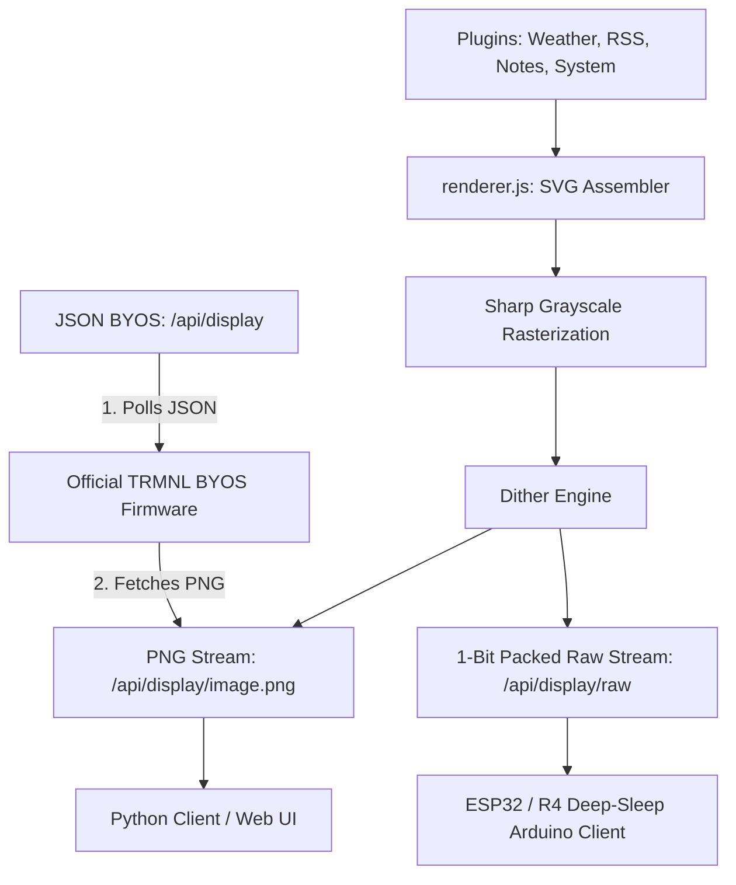
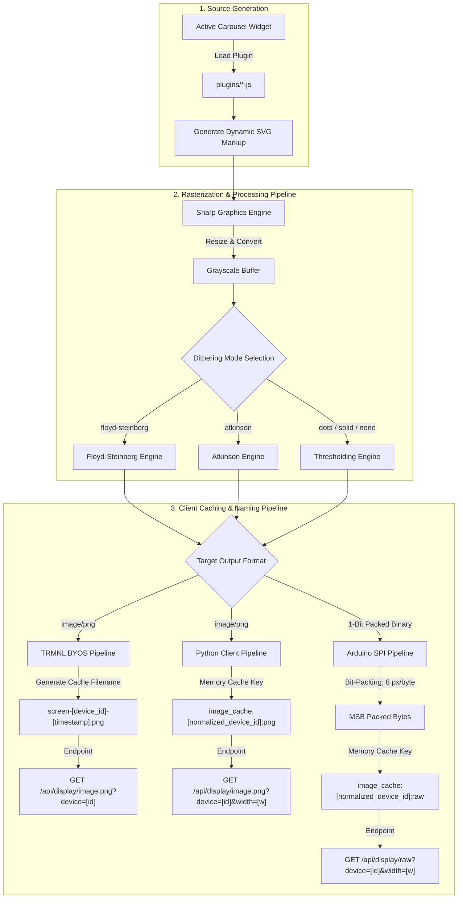
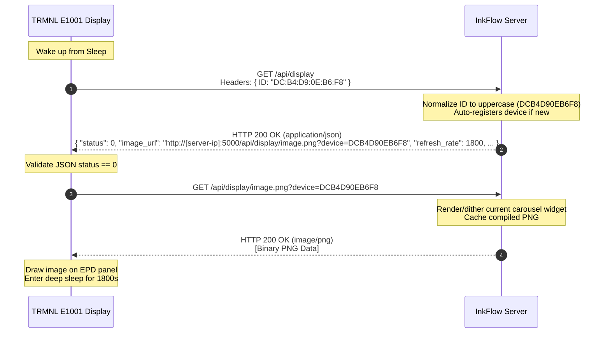
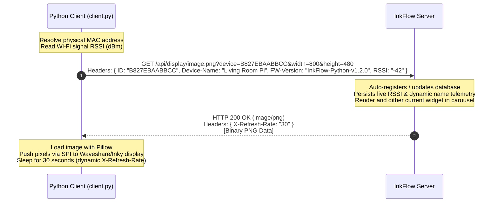
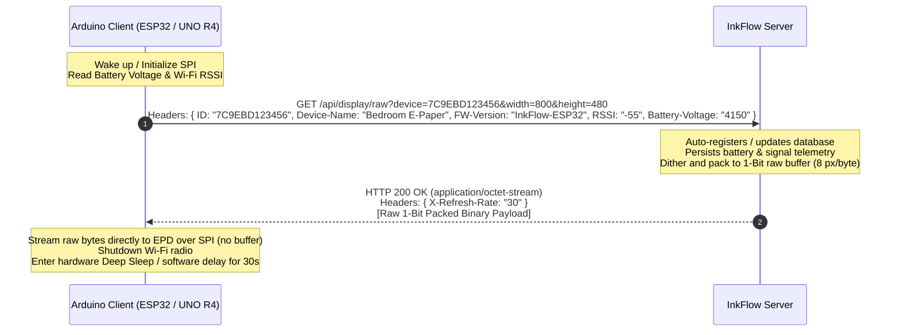

# 🚀 InkFlow E-Ink Server — Custom E-Paper Dashboard Server

An optimized, premium Node.js Express server that aggregates data from multiple plugins/widgets , compiles them into responsive full-screen carousel cycles, rasterizes them to grayscale, and applies high-contrast **Floyd-Steinberg dithering** for physical **E-Ink / E-Paper Displays**.

Supports trmnl and trmnl BYOD devices as well as inkflow python/debian and arduino/ESP32 C++ clients supporting serving of png files as well as memory efficient streaming of image data for memory constrained clients such as Arduino.

Designed for in home LAN deployments with plug and play features for automatic client registration.

Each registered device can be configured to display a selection of the available widgets in a defined order with a display duration for each one.

The image below shows the reTeminal E1001 running trmnl firmware (left), Raspberry Pi Zero 2W running Inkflow python client (middle) and an Arduino Uno R4 Wifi running the Inkflow C++ client (right).
These are all served from a single Raspberry Pi 5 Server (middle rear).


---

## 🏗️ Architecture & Features



### 1. Symmetrical Carousel (Rotation) Mode
* Seamlessly cycles through all of your active widgets at full-screen resolution. Displays one widget per refresh cycle, ensuring maximum legibility, large premium typography, and 0% text truncation!
* Core widgets/plugins included are:
  * **System Stats**: Monitors Raspberry Pi system health (CPU load, memory, disk utilization, uptime, temperature).
  * **Weather Forecast**: Open-Meteo local weather forecasts with daily high/low temperatures, precipitation, and wind.
  * **RSS Feed**: Aggregates headlines from major presets (Tech, UK, World, HN, NYT) or a custom XML RSS feed url.
  * **Family Notice Board**: A fully interactive notice board with checklists and chores customizable inline.
  * **TfL Rail Status**: Live London Underground, Overground, DLR, and Elizabeth Line disruption tracker.
  * **UK Train Board**: Real-time mainline station departures and arrivals styled after authentic LED station boards.
  * **XKCD Comics**: Scaled comic strips fetched from the daily archive.
  * **World Sun & Moon Clock**: Day/night solar and lunar maps overlaying daylight terminator curves onto dot-matrix/solid projections.
  * **Daily AI Briefing**: Synthesizes custom RSS feeds and weather coordinates using Google Gemini into an elegant broadsheet.
  * **AI Telemetry Advisor**: Analyzes system logs and load averages, outputting technical administrator recommendations.
  * **Feynman Quotes**: Displays inspiring daily quotes from physicist Richard Feynman.

The sever also features an  **Plugin Studio** which Hot-loads natural language descriptions into verified Javascript display widgets on-the-fly.

### 2. High-Performance E-Ink Processing
* **Advanced E-Paper Dithering Suite**:
  * **Floyd-Steinberg Dithering**: Custom 1-bit dithering engine written with `Int16Array` error diffusion to ensure crisp shadows and readable gradients.
  * **Atkinson Dithering**: Crisp, high-contrast dithering algorithm (classic Apple E-Ink standard) which distributes only 3/8 of quantization errors. Confining error distribution completely prevents high-frequency pixel clusters and electrical charge leakages, avoiding the common "faded" look on physical panels.
  * **Thresholded Dot-Matrix / Solid Outline (`dots` / `solid` / `none`)**: Bypasses dithering to perform pure mathematical thresholding, resulting in perfectly crisp black-and-white vectors.
* **1-Bit Raw Bit-Packing**: Packs dithered pixels (8 pixels per byte, MSB-first) into a tight binary buffer suitable for lightweight transmission.
* **Ultra Low Power**: Native support for display deep sleep (using custom `X-Refresh-Rate` control headers), allowing hardware microcontrollers (like ESP32) to sleep at **~10µA current draw** and run on batteries for months.

#### 🔄 Image Compilation & Naming Pipeline

The following flowchart and reference table detail the end-to-end rendering pipeline, detailing the output format, naming/caching keys, and REST endpoints for each supported client type:



| Client Type | Output Format | Cache Key/Naming Convention | Active REST Endpoint |
| :--- | :--- | :--- | :--- |
| **Official TRMNL BYOS** | `image/png` | `screen-[normalized_device_id]-[timestamp].png` | `GET /api/display/image.png?device=[id]` |
| **InkFlow Python Client** | `image/png` | `image_cache:[normalized_device_id]:png` | `GET /api/display/image.png?device=[id]&width=[w]&height=[h]` |
| **InkFlow Arduino Client** | `application/octet-stream` (1-bit packed) | `image_cache:[normalized_device_id]:raw` | `GET /api/display/raw?device=[id]&width=[w]&height=[h]` |

### 3. 🎨 Premium Glassmorphic Web Control Center
* **Three-Tab Interface**: Separates day-to-day E-Ink management (**Device Console**), custom plugin coding (**AI Studio**), and system keys/local hardware settings (**AI & Ollama Admin**).
* **Device Console**:
  * **Host Metrics Banner**: Real-time server telemetry dashboard (CPU circle chart, temperature, RAM gauges) is docked in a horizontal bar spanning full-width across the top of the console.
  * **Multi-Column Alignment**: Auto-discovered screen device lists and live dithered e-paper mockup bezels align side-by-side cleanly to optimize spacing.
  * **Spacious bottom settings drawer**: Form controls and the drag-and-drop of the rotation sequence timeline expand horizontally, giving you maximum width to reorder and calibrate display rotation cycles.
* **AI Plugin Studio**:
  * **In-Tile Forms**: Each plugin card in the catalog houses its own config template. Form fields open inline with smooth glass slide animations.
  * **Dedicated AI Preview Bezel**: Saving inline options compiles a Floyd-Steinberg dithered preview directly on a separate mockup frame, leaving active device cycles un-interrupted.
* **AI & Ollama Admin**:
  * **Local and Cloud AI**: AI LLMs are used both to produce AI summaries of plugin data to display and also design additional plugins. The admin console allows one to chose the AI models used for various tasks.
  
---

## 📁 Repository Structure

* [**`server.js`**](server.js): Express web application serving API endpoints and administering configuration states.
* [**`renderer.js`**](renderer.js): Core graphic engine (plugin coordinator, SVG parser, Sharp rasterizer, ditherer, and raw byte packetizer).
* [**`plugins/`**](plugins): Javascript widgets performing web fetches and compiling custom e-ink SVG code.
  * Core: [`system.js`](plugins/system.js), [`weather.js`](plugins/weather.js), [`rss.js`](plugins/rss.js), [`notes.js`](plugins/notes.js), [`tfl.js`](plugins/tfl.js), [`uk_trains.js`](plugins/uk_trains.js), [`xkcd.js`](plugins/xkcd.js), [`world_clock.js`](plugins/world_clock.js), [`feynman_quote.js`](plugins/feynman_quote.js), [`airport_board.js`](plugins/airport_board.js), [`tide_timetable.js`](plugins/tide_timetable.js).
  * Gemini AI: [`ai_briefing.js`](plugins/ai_briefing.js), [`ai_advisor.js`](plugins/ai_advisor.js).
* [**`public/`**](public): Sleek HTML5 / CSS3 local control panel to configure active widgets, rotation intervals, and custom settings.
* [**`client/`**](client): Python-based client supporting local mockup preview files, Pimoroni Inky series, and SPI-connected Waveshare EPD hats.
* [**`arduino/`**](arduino): Optimized C++ Arduino code driving Waveshare E-Paper displays via SPI (featuring native hardware deep sleep on ESP32, and simulated deep sleep via software delay loops and hardware-level restarts on UNO R4).
* [**`install.sh`**](install.sh): One-click Linux server automated service setup and daemon registration.
* [**`inkflow.sh`**](inkflow.sh): Master server control, system diagnostics, and safe update assistant.
* [**`client/inkflow-client.sh`**](client/inkflow-client.sh): Master client installer, telemetry scanner, and daemon manager.


---

## 📡 API Reference

### 1. Serving PNG Stream
* **URL**: `GET /api/display/image.png`
* **Query Parameters**:
  * `device` (default: `default_screen`): Unique device identification.
  * `force` (`true`/`false`): Bypasses memory caches to refresh immediately.
* **Response**: `image/png` binary stream.

### 2. Serving 1-Bit Packed Binary Stream
* **URL**: `GET /api/display/raw`
* **Query Parameters**:
  * `device`: Unique device identification.
  * `width`/`height`: Dimensions to compile and pack.
* **Headers**:
  * `X-Refresh-Rate`: Number of seconds the receiver should sleep before the next request.
* **Response**: `application/octet-stream` byte stream (8 pixels per byte, MSB-first, 1=white, 0=black).

### 3. TRMNL Official BYOS Protocol Endpoint
* **URL**: `GET /api/display`
* **Headers**: Passed by the physical device:
  * `ID`: Hardware MAC address (e.g., `DC:B4:D9:0E:B6:F8`)
* **Response**: JSON payload conforming to the official TRMNL BYOS hardware requirements:
  ```json
  {
    "status": 0,
    "image_url": "http://[server-ip]:5000/api/display/image.png?device=[device-id]",
    "filename": "screen-[device-id]-[timestamp].png",
    "image_name": "screen-[device-id]-[timestamp].png",
    "update_firmware": false,
    "firmware_url": null,
    "refresh_rate": 1800,
    "reset_firmware": false
  }
  ```
  > [!NOTE]
  > Under the TRMNL BYOS protocol, the `status` field must be set to `0` inside the JSON body to indicate success. A status code of `200` or standard HTTP success codes inside the JSON body will be rejected by the device's firmware as an error, causing it to retry immediately without downloading the E-Ink display image.


---

## 🔄 Client Registration & Update Flows

These sequence diagrams illustrate the step-by-step communication process, API endpoints, headers, and responses for each of the three supported client types.

### 1. Official TRMNL Firmware Client (BYOS Protocol)
The official Seeed reTerminal E1001 or standard TRMNL BYOS hardware utilizes a two-step poll: first fetching a JSON control payload, then downloading the compiled PNG image.



### 2. InkFlow Python Client
The standalone Python client script (`client.py`) performs a single-step fetch, directly pulling the rasterized and dithered PNG image while providing dynamic system telemetry.



### 3. InkFlow Arduino Client (ESP32 / UNO R4)
The memory-constrained C++ microcontroller client pulls a raw, dithered 1-bit packed binary stream to fit within limited SRAM boundaries, entering hard deep sleep between frames.



---

## 🚀 Getting Started & Setup

### 💻 Headless Native Local Network Installation (Highly Recommended)
This is the **most robust and reliable method** for setting up your Raspberry Pi 5. It uses the official uncorrupted Raspberry Pi OS Lite, flashes it via the Imager, and copies your exact local workspace files directly over your home Wi-Fi using built-in Windows OpenSSH (`scp`).

#### 1. Flash a Fresh Official OS
* Open **Raspberry Pi Imager** normally on your PC.
* **Choose Device**: Select **Raspberry Pi 5** (or your Pi model).
* **Choose OS**: Navigate to **Raspberry Pi OS (other)** -> Select **Raspberry Pi OS Lite (64-bit)** (clean, official headless OS).
* **Choose Storage**: Select your SD card.
* Click **Next** -> Click **EDIT SETTINGS**:
  * **General**: Set your choice of **Username** and **Password**, and configure your **Wi-Fi** SSID and Password.
  * **Services**: Check **Enable SSH** (using password authentication).
* Click **Save** and write the image to your SD card. Insert the card into your Pi and power it up.

#### 2. Pack & Copy Files (via PowerShell/Terminal)
Open a terminal (e.g. **PowerShell** on Windows or Terminal on macOS/Linux) and run these commands to compress your workspace (excluding massive development dependencies) and copy it directly to the Pi:
```bash
# cd into your workspace folder
cd "/path/to/your/inkflow-eink"

# Pack workspace into a lightweight archive in the parent directory
tar -czf ../inkflow-eink.tar.gz --exclude="node_modules" --exclude="*.img" --exclude="*.xz" .

# Transfer the archive to the Pi (replace <USERNAME> and <IP-ADDRESS> with your credentials)
scp ../inkflow-eink.tar.gz <USERNAME>@<IP-ADDRESS>:~/

# Delete the temporary local archive
rm ../inkflow-eink.tar.gz
```
*(Tip: If `ssh` blocks the connection with a "host identification has changed" warning because you flashed a new OS, clear it with `ssh-keygen -R <IP-ADDRESS>` first).*

#### 3. Extract and Install Natively on the Pi
Connect to your Pi via SSH and run the native installer to compile everything natively for the Pi's arm64 architecture:
```bash
# SSH into the Pi (use your custom username)
ssh <USERNAME>@<IP-ADDRESS>

# Extract the package
mkdir -p ~/inkflow-eink
tar -xzf inkflow-eink.tar.gz -C ~/inkflow-eink
cd ~/inkflow-eink

# Strip Windows line endings and run the native automated installer
sed -i 's/\r$//' *.sh
chmod +x install.sh
sudo ./install.sh
```
Once the installer completes, the server will be running persistently in the background. Open your browser and navigate to `http://<your-pi-ip>:5000` to manage your server!

#### 💡 Alternative: Direct Git Sparse Checkout (Cleanest, Server-Only Installation)
If your Pi 5 has direct internet access, you can run a **Git Sparse Checkout** directly on your server Pi. This will download only the server and client files, entirely omitting the `arduino/` subdirectory (since it is only for microcontrollers) to keep your server installation clean, lightweight, and clutter-free while still allowing it to serve client setup files locally:
```bash
# 1. Install Git and create a sparse repository folder on the Pi
sudo apt update && sudo apt install -y git
mkdir -p ~/inkflow-eink && cd ~/inkflow-eink
git init

# 2. Add remote repository upstream
git remote add origin https://github.com/DerrickJEvans/inkflow-eink.git

# 3. Enable sparse-checkout and exclude only the arduino/ folder (to keep client scripts available)
git config core.sparseCheckout true
echo '/*' >> .git/info/sparse-checkout
echo '!/arduino/' >> .git/info/sparse-checkout

# 4. Pull origin/main (this will fetch all server and client files!)
git pull origin main

# 5. Strip Windows line endings (if git configured it) and run the installer
sed -i 's/\r$//' *.sh
chmod +x install.sh
sudo ./install.sh
```

> [!TIP]
> **GitHub Authentication Issues**: If your repository is set to private, Git will prompt you for your credentials on `git pull`. Because GitHub **no longer supports standard account passwords** for CLI operations, you must generate and enter a **Personal Access Token (PAT)** classic (from GitHub Settings -> Developer settings -> Personal access tokens with the `repo` scope enabled) as your password. Alternatively, you can use your SSH key credentials by changing the remote origin to the SSH address: `git remote set-url origin git@github.com:DerrickJEvans/inkflow-eink.git`.

## 🛠️ Master Server Manager Utility (`inkflow.sh`)

To make managing your E-Ink server as seamless as possible, we have developed a master control utility bash script: **[`inkflow.sh`](inkflow.sh)** located in the root of your repository. 

This utility acts as your server command center, providing a comprehensive, user-friendly interactive terminal menu as well as quick CLI shortcut commands to run diagnostics, start/stop services, view live log streams, and safely execute system updates.

### 🕹️ 1. Interactive Terminal Console
Run the script without arguments in your server terminal to launch a clean, colorful menu dashboard:
```bash
cd ~/inkflow-eink
./inkflow.sh
```

The console displays real-time system states (running/stopped), active host IP addresses, and provides instant navigation options:
* `[1] Start InkFlow E-Ink Server`
* `[2] Stop InkFlow E-Ink Server`
* `[3] Restart InkFlow E-Ink Server`
* `[4] View Real-Time Live Logs`
* `[5] Run System Diagnostics & Network Check`
* `[6] Pull Core Codebase Updates`
* `[7] Exit`

---

### 🚀 2. Quick Command CLI Shortcuts
You can bypass the menu and execute operations directly from the command line by passing an action argument:

| Command | Privileges | Action / Description |
|:---|:---|:---|
| **`./inkflow.sh start`** | `Sudo` | Escalates privileges and starts the background `inkflow-eink.service` daemon. |
| **`./inkflow.sh stop`** | `Sudo` | Stops the persistent background server daemon safely. |
| **`./inkflow.sh restart`** | `Sudo` | Restarts the background server daemon. |
| **`./inkflow.sh logs`** | None | Opens a live scroll feed of active server logs (`journalctl -u inkflow-eink -f`). |
| **`./inkflow.sh status`** | None | Performs a **Comprehensive Diagnostics Scan** (see below). |
| **`./inkflow.sh update`** | None | Performs a safe config backup, pulls latest Git code, updates npm dependencies, and restarts services. |

---

### 🔍 3. Comprehensive Diagnostics Scan (`./inkflow.sh status`)
Running status diagnostics initiates a deep scan of your host environment, rendering a structured readout detailing:
1. **Service Status**: Checks if the background `inkflow-eink.service` is active, enabled, or stopped in systemd.
2. **Listener Port Binding**: Scans TCP port `5000` to confirm that the Node.js Express server is listening properly.
3. **Primary IP Address**: Automatically resolves and displays your host's local IP address to make it easy to find your web dashboard URL.
4. **Ollama Local AI Engine Status**: Detects whether Ollama is running and verifies if the lightweight `llama3.2:1b` model has been successfully pulled.
5. **Disk Capacity Check**: Verifies active host storage capacity to ensure your server doesn't run out of space for widget logs or image caches.
6. **Active E-Ink Screens**: Reads and details all registered screens, custom names, and carousel rotation states directly from your database config.

---

## 🧠 Multi-Provider AI Integration (Gemini, Groq, & Local Ollama)

InkFlow E-Ink Server has been upgraded to support a **deep, modular integration with Google Gemini, Groq (Llama), and Local Ollama AI engines**. This adds three dynamic, cognitive features to your low-power display:

### 1. ✨ AI Widget Builder (Natural Language Generator)
Describe any custom widget you want in the control panel (e.g. *"Build a widget that displays random developer jokes with a cool pixel border"* or *"A cryptocurrency ticker displaying BTC and ETH"*), and your active AI engine will automatically generate, compile, and register a compliant JavaScript plugin in real-time **without restarting the server!**

* **Automatic Key Configuration (Dynamic Config Fields)**: If a generated widget relies on an external API provider that requires credentials (such as an API key or access token), the AI engine automatically specifies these requirements inside its `configFields` schema. The InkFlow web console then dynamically compiles form inputs—utilizing secure password masking for credentials—inside the widget's expandable tile and persists them safely in `config.json`.
* **Symmetrical Deletion & Clean Purge**: You can safely delete any AI-generated widget with a single click of the **🗑️ Delete** button. The server unlinks the plugin's file, cleanly unloads it from memory, prunes it from all registered screens' rotation carousels, purges all associated cached JSON data files, and cleanses the configuration registry.

### 2. 🗞️ Daily AI Briefing (`plugins/ai_briefing.js`)
An elegant editorial newspaper-style morning bulletin written in the voice of an elite print editor, synthesizing your weather parameters and RSS news items into a concise, engaging narrative. Renders using broadsheet serif typography and dynamic SVG line-wrapping.

### 3. 🛠️ AI Telemetry Advisor (`plugins/ai_advisor.js`)
A proactive diagnostic monitor that parses real-time system performance data (CPU load, temperature, RAM utilization, and disk space) and returns exactly 2-3 short, actionable system administrator recommendations inside a technical E-Ink monospace card.

### 📡 Intelligent API Quota Cooldown Layer (Anti-Rate-Limiting)
To prevent `429 Too Many Requests` rate-limiting errors under free API tier limits during high-frequency background scheduler sweeps (which check widgets every 4 minutes), the AI integrations incorporate a robust caching cooldown layer:
* **Daily Briefing Cooldown (`ai_briefing.js`)**: Successful editorial briefs are cached with a **1.5-hour (90 minutes) cooldown**. During background sweeps, the server serves the compiled cached bulletin rather than requesting the API again.
* **Telemetry Insights Cooldown (`ai_advisor.js`)**: Diagnostic server tips are cached with a **45-minute cooldown**.
* **Manual Override (Bypass)**: Clicking **🔄 Force Refresh** (or updating layout settings) inside the web control panel completely purges the cached JSON data files, bypassing the cooldown timer and triggering a fresh, real-time generation instantly.

### 🔑 Setting up the AI Providers in `.env`
To activate these cognitive features, configure **one** of the following providers inside a `.env` file in your server's root folder:

#### Option A: Google Gemini API (Cloud)
1. Obtain a free API Key from [Google AI Studio (aistudio.google.com)](https://aistudio.google.com/).
2. Add it to your `.env` file:
   ```env
   GEMINI_API_KEY=AIzaSyYourActualKeyHere
   ```

#### Option B: Local Ollama LLM (100% Free & Infinite Limits)
1. Install Ollama natively on your host: `curl -fsSL https://ollama.com/install.sh | sh`
2. Download your preferred lightweight model (e.g. `llama3.2:1b` or `qwen2.5:1.5b` which run at high speeds on Raspberry Pi 5):
   ```bash
   ollama run llama3.2:1b
   ```
3. Enable it in your `.env` file:
   ```env
   OLLAMA_ENABLED=true
   OLLAMA_HOST=http://localhost:11434
   OLLAMA_MODEL=llama3.2:1b
   ```

#### Option C: Groq Developer Tier (Generous Quotas & High Speed)
1. Create a free developer account at [console.groq.com](https://console.groq.com/) and create an API key.
2. Add it to your `.env` file:
   ```env
   GROQ_API_KEY=gsk_YourActualKeyHere
   GROQ_MODEL=llama-3.1-8b-instant
   ```

#### 🎛️ Independent Dual-Engine Routing (Hybrid Mode)
InkFlow supports **independent AI engine routing** for different application roles. This allows you to utilize an elite cloud-hosted model (like Gemini Pro) specifically for the **✨ AI Widget Builder** (which requires high-powered code reasoning), while running daily text widgets (like the Daily Briefing or Telemetry Insights) completely free and locally using Ollama:

* **`WIDGET_BUILDER_AI_PROVIDER`**: Configures the AI engine specifically for code and SVG generation (values: `gemini`, `groq`, `ollama`, or `none`).
  * *Note: When running on Gemini, the Widget Builder dynamically scales up to **`gemini-2.5-pro`** to ensure high-fidelity code and pristine SVG layouts.*
* **`DYNAMIC_WIDGETS_AI_PROVIDER`**: Configures the AI engine for runtime summaries and briefings (values: `gemini`, `groq`, `ollama`, or `none`).
  * *Note: When running on Gemini, dynamic widgets consume the low-latency **`gemini-2.5-flash-lite`** to conserve free-tier API quotas.*

*If these variables are omitted, the server automatically defaults to the first fully configured API key/flag on your host.*

Example hybrid-engine `.env` configuration:
```env
# Cloud Gemini Pro for elite, complex E-Ink coding tasks
GEMINI_API_KEY=AIzaSyYourActualKeyHere
WIDGET_BUILDER_AI_PROVIDER=gemini

# Local Ollama for infinite, free daily briefings on your Pi 5
OLLAMA_ENABLED=true
DYNAMIC_WIDGETS_AI_PROVIDER=ollama
```

### 🎛️ Dedicated AI & Ollama Admin Control Panel (Tab 3)
InkFlow includes a state-of-the-art **🧠 AI & Ollama Admin** administration portal built as a sleek, responsive two-column glassmorphic grid:

1. **Left Column: 🦙 Ollama Local Manager (Unified Card)**:
   * **🌐 Host Configuration**: Dynamic connection host address input (`OLLAMA_HOST`) allowing seamless targeting of WSL, Docker, or native daemon IP addresses.
   * **🧠 Active Local Model Selection**: Dropdown menu compiled dynamically from your active Ollama instance, listing installed model names and parameter file sizes.
   * **● Real-time Status Badge**: Glowing emerald `ONLINE` or pulsing crimson `OFFLINE` connectivity tracker.
   * **📥 Model Pull Console**: Asynchronous downloader that streams model pull operations directly. A glowing progress bar and real-time percentage indicators track progress in the dashboard without locking browser threads.
   * **Installed Local Models**: A dedicated scrolling dashboard list displaying all downloaded model details.

2. **Right Column: Stacked Engine Routing & Cloud API Managers**:
   * **⚙️ AI Engine Feature Routing**: Dropdown selection controls mapping Widget Builder and Dynamic Summarization features independently to active providers.
   * **♊ Gemini API Manager**: Secure masked input (`GEMINI_API_KEY`) with quick links to retrieve free AI Studio tokens.
   * **🍊 GROQ API Manager**: Secure masked input (`GROQ_API_KEY`) with developer console credentials integration.
   * **💾 Symmetrical Save & Hot-Reload**: A single action button at the bottom of the right column. Submitting updates writes changes securely to the `.env` file on disk and triggers `aiCore.reloadAiConfig()` to re-instantiate active engines in server memory. **The server dynamically scales in real time without needing a manual command-line process reboot!**

---

## 📟 Connecting Screens & Clients

### 1. Arduino C++ (ESP32 or UNO R4 WiFi + Waveshare E-Paper)
Navigate to the [`arduino/`](arduino) directory, open your chosen client sketch (`arduino_client.ino` or `arduino_r4_client.ino`) in the Arduino IDE, install GxEPD2/Adafruit GFX (if using ESP32), select your display driver chip in `config.h`, compile and upload! Once booted, simply connect your phone or computer to the password-free **`InkFlow-Setup`** (for ESP32) or the WPA2-secured **`InkFlow-R4-Setup`** (for UNO R4 WiFi, using password **`12345678`**) WiFi Access Point to configure WiFi credentials, your server IP address, port, and display name dynamically via the beautiful web captive portal!

### 2. Python Client (Raspberry Pi Zero 2 W + Waveshare 4.26" 800x480 Display)
Designed to run on a headless Raspberry Pi Zero 2 W equipped with a **Waveshare E-Paper Driver HAT Rev 2.3** and a **4.26" e-Paper Display (800x480)**.

#### 1. Assembly & Hardware Setup
* Plug the **Waveshare E-Paper Driver HAT Rev 2.3** directly onto the Pi Zero 2 W's 40-pin GPIO header.
* Connect the **4.26" e-Paper panel** to the HAT using the flat ribbon cable (FFC) via the GH1.25 9-pin connector. Make sure the pins face upward and the flip latch at the back is firmly locked.
* Boot a clean **Raspberry Pi OS Lite (64-bit)** card flashed with Imager (enabling SSH & Wi-Fi in the custom settings).

#### 2. OS SPI Configuration
Connect to the Pi Zero 2 W via SSH and enable the hardware SPI bus:
```bash
sudo raspi-config
# Select 'Interface Options' -> 'SPI' -> 'Enable (Yes)' -> 'Finish' & Reboot.
```

#### 2. Get the Client Code (Git Sparse Checkout)
To download *only* the client code on your standalone client Pi Zero without downloading server code or large node packages, run these commands in your client Pi's SSH terminal to perform a highly efficient sparse checkout:
```bash
# Install Git and initialize a sparse repository locally on the client Pi
sudo apt update && sudo apt install -y git
mkdir -p ~/inkflow-client && cd ~/inkflow-client
git init

# Add the remote repository URL
git remote add origin https://github.com/DerrickJEvans/inkflow-eink.git

# Configure git to only check out the client folder
git config core.sparseCheckout true
echo 'client/*' >> .git/info/sparse-checkout

# Pull origin/main (this will only download the client folder!)
git pull origin main
```
This isolates the client files cleanly under `~/inkflow-client/client/`.

> [!TIP]
> **GitHub Authentication Issues**: If your repository is set to private, Git will prompt you for your credentials on `git pull`. Because GitHub **no longer supports standard account passwords** for CLI operations, you must generate and enter a **Personal Access Token (PAT)** classic (from GitHub Settings -> Developer settings -> Personal access tokens with the `repo` scope enabled) as your password. Alternatively, you can use your SSH key credentials by changing the remote origin to the SSH address: `git remote set-url origin git@github.com:DerrickJEvans/inkflow-eink.git`.

#### 3. Run the Automated Client Installer (`inkflow-client.sh`)
We have created a master client management script `inkflow-client.sh` to automate the entire process (installing dependencies, enabling hardware SPI, installing Waveshare drivers, setting up `.env` files, and registering systemd services) under a single interactive CLI.

To configure your client automatically, run:
```bash
cd ~/inkflow-client/client
chmod +x inkflow-client.sh
./inkflow-client.sh
```
* **Select Option `[1]` (Run Automated Client Setup/Installer)**.
* When prompted, enter your main TRMNL Server IP address (e.g. `192.168.1.100`).
* The installer will handle all package updates, enable SPI in `/boot/firmware/config.txt`, perform a low-RAM sparse install of Waveshare python drivers to prevent crashes, create a secure local `.env` configuration file, and spawn a persistent background service daemon (`inkflow-client.service`).

#### 4. Managing and Upgrading the Client
Your client is now fully active! You can use `inkflow-client.sh` anytime to manage operations:
* **Interactive Dashboard**: `./inkflow-client.sh` (opens the colorful control console)
* **Check live telemetry & connection diagnostics**: `./inkflow-client.sh status`
* **Stream real-time background logs**: `./inkflow-client.sh logs`
* **Safely pull code upgrades and restart services**: `./inkflow-client.sh update`


---

## 🐳 Simplified Deployment & Orchestration

To simplify provisioning and deploying both the server backend and the client displays on linux systems, we have pre-packaged automated orchestration files below (Options 1 & 2 for the Server, Option 3 for the Client). 

> [!NOTE]
> You can choose **either** a native bare-metal host deployment (Option 2) **or** a containerized sandboxed deployment (Option 1). They are separate paths—choose the one that best fits your server environment!

### 1. Multi-Container Dockerized Server & Local AI Deployment
You can deploy a new InkFlow E-Ink Server **and** a local, fully dedicated Ollama instance anywhere with a single command—no manual model downloading, Node.js installations, or compilation required!

**Prerequisite:** Ensure **Git**, **Docker**, and **Docker Compose** are installed on the host.

#### 1. Clone the Repository
First, clone the codebase to your server host and navigate into the root directory:
```bash
git clone https://github.com/DerrickJEvans/inkflow-eink.git
cd inkflow-eink
```

#### 2. Spin Up Containers
* Run this command in your server's root folder:
  ```bash
  docker compose up -d --build
  ```
* **What it does automatically:**
  1. Spins up the main **InkFlow server container** on port `5000`.
  2. Spawns an **interconnected Ollama container** in an isolated virtual bridge network.
  3. Binds and preserves your E-Ink caches (`cache/`), configurations (`config.json`), `.env` secrets, and LLM model files (`ollama-data` volume) persistently on the host.
  4. Allows the server to query local models by simply pointing `OLLAMA_HOST` in `.env` to `http://ollama:11434`.

### 2. Auto-Provisioning Server Installer & Safe Updater (Native Bare-Metal)
If you prefer to run the server natively on your host machine without container sandboxing (e.g., directly on a Raspberry Pi 5 OS), you can use the automated installer shell script.

**Prerequisite:** Ensure **Git** is installed on the host. *(Docker is NOT required).*

#### 1. Clone the Repository & Navigate
First, clone the codebase to your server host and navigate into the root directory:
```bash
git clone https://github.com/DerrickJEvans/inkflow-eink.git
cd inkflow-eink
```

#### 2. Run the Installer or Updater
* **Fresh Installs (`install.sh`)**: Run the installer script to automatically setup Node.js dependencies, check/install Ollama natively as a systemd service, pull `llama3.2:1b`, and register the `inkflow-eink.service` system daemon:
  ```bash
  sudo chmod +x install.sh
  sudo ./install.sh
  ```
* **Current Server Upgrades (`update.sh`)**: Run the upgrade script on your active server to automatically clean local Git states, pull new code, install new npm dependencies, update Ollama models, append any new local `.env` keys, and restart the backend daemons cleanly:
  ```bash
  chmod +x update.sh
  ./update.sh
  ```

### 3. One-Line Client Bootstrapper (`client/setup_client.sh`)
Provisioning new Raspberry Pi Zero 2 W clients has been consolidated into a single piped command. 
* Flash a clean Raspberry Pi OS Lite image. SSH into your client.
* Run this command on the client (replacing `<server-ip>` with your actual server IP or local mDNS hostname):
  ```bash
  curl -sSL http://<server-ip>:5000/setup_client.sh | sudo bash
  ```
* **Prerequisites:** 
  * The **InkFlow Server** must be deployed and running on your network (as it hosts this setup script).
  * The client Pi must have internet access to fetch the driver libraries and latest executable scripts.
* **What it does automatically:**
  1. Installs all prerequisite system packages (SPI drivers, python3-pip, Git, PIL, NumPy, and Requests).
  2. Enables hardware SPI interfaces in `/boot/config.txt` or `/boot/firmware/config.txt`.
  3. Orchestrates a memory-safe partial Git checkout of the Waveshare Python libraries to prevent 512MB RAM client crashes.
  4. Automatically downloads the latest client runtime components (`client.py` and `inkflow-client.sh`) directly from the GitHub repository into the local directory.
  5. Prompts you for the target server's address and generates/updates `config.py`.
  6. Registers, enables, and boots up a persistent `inkflow-client.service` daemon background service.

---

## 🛡️ License

This project is released under the [MIT License](LICENSE) (MIT). Feel free to use, fork, modify, and integrate it into your custom low-power dashboard environments!
