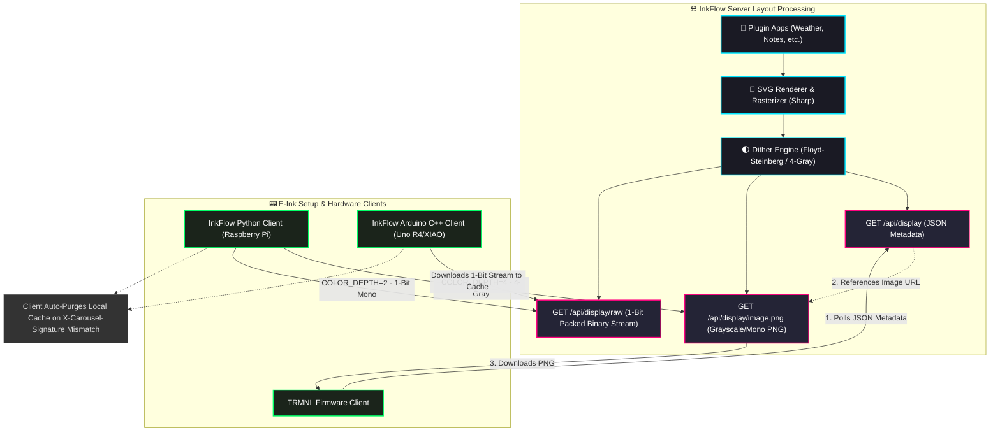
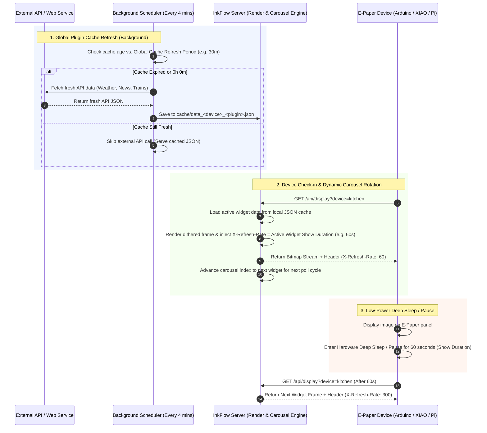
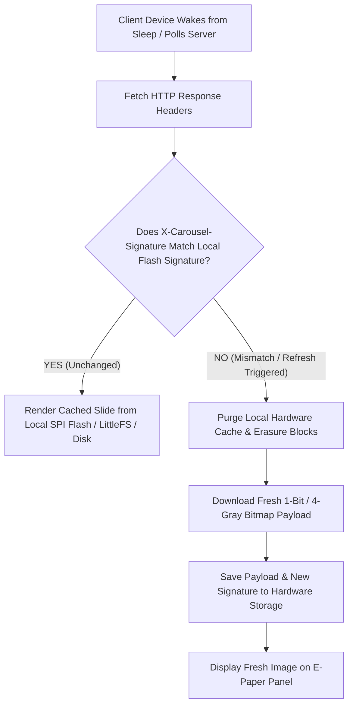

# 🚀 InkFlow E-Ink Server — Universal Custom E-Paper Dashboard Platform

An optimized, premium Node.js Express server that aggregates data from multiple plugins as beautiful SVG layouts, rasterizes them with advanced high-contrast dithering, and serves them dynamically to multiple physical **E-Ink Displays** of varying sizes.

Designed for self-hosted home LAN environments, InkFlow supports a wide variety of client screens—ranging from official TRMNL hardware to Raspberry Pi Zero standalone clients and ultra-low-power memory-constrained Arduino/XIAO microcontrollers—allowing you to build the ultimate wireless status console.


The Node JS Express server code has been built and tested on Raspberry PI 4 B and 5.

Python client code  has been built and tested using Raspberry Pis Zero 2W, 4 and 5 using Raspbian Bookworm and Trixie with a Waveshare ePaper HAT. The Arduino C++ client has been built using an Arduino Uno R4 Wifi with Waveshare ePaper Shield. There is also an ESP32S client based on the SEEED Studio EE04 ePaper Board also written in C++.

Optionally, for the Python client on a Raspberry Pi, there is support for capacitive touch buttons using the Adafruit MPR 121 module to provide forward and back buttons plus a diagnmostic page and a configuration captive web page.

The C++ MCU clients have support for tactile physical buttons connected to spare GPIO ports to provide the same control functionality.

The image above shows SEED Studio reTerminal client, with TRMNL firmware, and a Raspberry Pi 4B python client with WaveShare ePaper Hat and 7.5 inch screen and capacitive touch buttons in 3D printed enclosure. Also shown are the Arduino UNO R4 client and also the Seeed Studio EE04 board with 4.26 inch panels.

---

## 📸 Example Client & Server Setup

The image below shows the **reTerminal E1001** running TRMNL firmware (left), **Raspberry Pi Zero 2W** running the InkFlow Python client (middle), and an **Arduino Uno R4 WiFi** running the InkFlow C++ client (right). These are all served dynamically from a single **Raspberry Pi 5 Server** (middle rear).


---

## 🏗️ Architectural Flow

InkFlow decouples high-fidelity rendering from display hardware. The server generates and rasterizes complex layouts, letting low-power clients simply fetch, draw, and sleep:


```mermaid
graph TD
    %% Define Styles
    classDef server fill:#1a1a24,stroke:#00e5ff,stroke-width:2px,color:#ffffff;
    classDef endpoint fill:#242436,stroke:#ff007f,stroke-width:2px,color:#ffffff;
    classDef client fill:#1b241b,stroke:#00ff66,stroke-width:2px,color:#ffffff;
    classDef note fill:#333333,stroke:#666666,stroke-width:1px,color:#dddddd;

    subgraph ServerSide ["🌐 InkFlow Server Layout Processing"]
        A["🔌 Plugin Apps (Weather, Notes, etc.)"]:::server --> B["🎨 SVG Renderer & Rasterizer (Sharp)"]:::server
        B --> C["🌓 Dither Engine (Floyd-Steinberg / 4-Gray)"]:::server
        
        C --> D1["GET /api/display (JSON Metadata)"]:::endpoint
        C --> D2["GET /api/display/image.png (Grayscale/Mono PNG)"]:::endpoint
        C --> D3["GET /api/display/raw (1-Bit Packed Binary Stream)"]:::endpoint
    end

    subgraph ClientSide ["📟 E-Ink Setup & Hardware Clients"]
        C1["TRMNL Firmware Client"]:::client
        C2["InkFlow Python Client (Raspberry Pi)"]:::client
        C3["InkFlow Arduino C++ Client (Uno R4/XIAO)"]:::client
    end

    %% Client 1 Connections
    C1 -->|1. Polls JSON Metadata| D1
    D1 -.->|2. References Image URL| D2
    D2 -->|3. Downloads PNG| C1

    %% Client 2 Connections
    C2 -->|COLOR_DEPTH=4 - 4-Gray| D2
    C2 -->|COLOR_DEPTH=2 - 1-Bit Mono| D3

    %% Client 3 Connections
    C3 -->|Downloads 1-Bit Stream to Cache| D3

    %% Notes
    N1["Client Auto-Purges Local Cache on X-Carousel-Signature Mismatch"]:::note
    C2 -.-> N1
    C3 -.-> N1
```

The TRMNL firmware client uses the TRMNL API to fetch JSON status information (`/api/display`), which directs it to download the compiled PNG image (`/api/display/image.png`). 

The InkFlow clients fetch layout data directly:
* **InkFlow Python Client (Raspberry Pi)**: Can operate in either **4-level Grayscale** (`COLOR_DEPTH=4`) by fetching the compiled PNG (`/api/display/image.png`) or **Monochrome** (`COLOR_DEPTH=2`, Default) by fetching the lightweight 1-bit binary pixel stream (`/api/display/raw`).
* **InkFlow Arduino C++ Client (Uno R4 / XIAO)**: Fetches raw pixel streams (1-bit packed for UNO R4, 4-level grayscale for XIAO) to stream directly to hardware display drivers or local flash/disk caches.

---

## ✨ Core Features Showcase

### 1. Display specific widget carousels
Seamlessly cycle through chosen active widgets at full-screen resolution on each connected client. One widget is displayed per refresh cycle at intervals specified per widget per client.

Bundled widgets include

* **Weather Forecast**: Open-Meteo local forecasts with daily high/low temperatures, precipitation, wind, and support for dynamic geocoding of UK postcodes.
* **RSS Feed**: Aggregates headlines from major presets (Tech, UK, World, HN, NYT) or a custom XML RSS feed URL.
* **Notice Board**: A fully interactive notice board with checklists and chores customizable inline.
* **TfL Rail Status**: Live London Underground, Overground, DLR, and Elizabeth Line disruption tracker.
* **UK Train Board**: Real-time mainline station departures and arrivals styled after authentic LED station boards.
* **System Stats**: Monitors Raspberry Pi system health (CPU load, memory, disk, uptime, temperature).
* **UK Fuel Prices**: Fetches live petrol and diesel prices from the official UK Government API with client OAuth credentials, geocodes UK postcodes dynamically on the fly, filters out prices older than 7 days, and displays sorted local and nationwide averages.
* **XKCD Comics**: Scaled comic strips fetched from the daily archive.
* **World Sun & Moon Clock**: Day/night solar and lunar maps overlaying daylight terminator curves onto dot-matrix/solid projections.
* **Daily AI Briefing**: Synthesizes custom RSS feeds and weather coordinates using Google Gemini into an elegant broadsheet.
* **AI Telemetry Advisor**: Analyzes system logs and load averages, outputting technical administrator recommendations.
* **Feynman Quotes**: Displays inspiring daily quotes from physicist Richard Feynman.

### 2. High-Performance E-Ink Processing
The various panels and client devices available have differing requirements to render an acceptable image. Inkflow server has a variety of features to optimise image production and delivery.
* **Advanced E-Paper Dithering Suite**:
  * **Floyd-Steinberg Dithering**: Custom 1-bit dithering engine written with `Int16Array` error diffusion to ensure crisp shadows and readable gradients.
  * **2-Bit / 4-Level Grayscale Dithering**: Custom 2-bit Floyd-Steinberg error diffusion engine that maps pixels to 4 distinct grayscale shades (`Black`, `Dark Gray`, `Light Gray`, and `White`). This is ideal for suitable grayscale-capable E-Paper panels, rendering rich gradients and high-fidelity shaded layouts.
  * **Atkinson Dithering**: Crisp, high-contrast dithering algorithm (classic Apple E-Ink standard) which distributes only 3/8 of quantization errors. Confining error distribution completely prevents high-frequency pixel clusters and electrical charge leakages, avoiding the common "faded" look on physical panels.
  * **Bayer Ordered Dithering**: High-performance deterministic point-wise ordered dithering available in both **4x4 (Classic Retro Pattern)** and **8x8 (Fine Ordered Pattern)** formats, producing smooth repeating threshold grids ideal for retro displays.
  * **Thresholded Dot-Matrix / Solid Outline (`dots` / `solid` / `none`)**: Bypasses dithering to perform pure mathematical thresholding, resulting in perfectly crisp black-and-white vectors.
* **1-Bit Raw Bit-Packing**: Packs dithered pixels (8 pixels per byte, MSB-first) into a tight binary buffer suitable for lightweight transmission on memory-constrained microcontrollers.
* **Color Inversion**: Easily toggle between `Standard (Black on White)` or `Inverted (White on Black)` rendering in your device settings to flip the contrast dynamically on the fly.
* **Ultra Low Power**: Native support for display deep sleep (using custom `X-Refresh-Rate` control headers), allowing hardware microcontrollers (like the ESP32-S3 on Seeed Studio XIAO) to sleep at **~10µA current draw** and run on batteries for months.
* **Post-Refresh Stabilization**: Automatically incorporates a 2-second stabilization delay post-refresh before putting the display to sleep or powering it off. This allows panel voltages to settle naturally, preventing the common "fading text" issue on physical e-paper panels.

### 3. Premium Glassmorphic Web Control Center
The inkflow server is controllable via a web page "control centre" with features to manage client devices, produce and configure plug in apps and manage the use of large language models in plug in productiona and operation.
* **Device Console**: Real-time server telemetry dashboard (CPU, temperature, RAM gauges) docked in a glassmorphic horizontal bar. Auto-discovered screen device lists and live dithered e-paper mockup bezels align side-by-side cleanly to optimize spacing.
* **Timeline Carousel Drawer**: Form controls and drag-and-drop rotation sequence timeline expand horizontally at the bottom of the console, giving you maximum width to reorder and calibrate display rotation cycles.
* **AI Plugin Studio**: Each plugin card in the catalog houses its own config template. Form fields open inline with smooth glass slide animations. Saving options compiles a Floyd-Steinberg dithered preview directly on a separate mockup frame, leaving active device cycles un-interrupted.

### 4. Background Cache & Configurable Refresh Periods
InkFlow operates a decoupled background caching scheduler (`scheduler.js`) to minimize hits on third-party source APIs (such as TfL, weather APIs, or the UK Government Fuel Prices API).Source data is collected from sources asynchronously to image production and distribution.
* **Decoupled Background Caching**: The scheduler runs a check sweep every **4 minutes** in the background.
* **Granular Refresh Periods**: Every single plugin can be configured with a custom cache expiration window (specified in both hours and minutes) directly from its settings accordion on the Web Control Center.
* **Smart Bypassing**: Setting a plugin's refresh period to **`0 hours 0 minutes`** disables cache checks for it, meaning the scheduler will fetch fresh data on every 4-minute cycle (the default behavior for most widgets).

### 5. Premium SVG Widget Layouts & Styling
InkFlow widgets are styled using high-contrast design principles optimized for grayscale e-paper panels:
* **High-Contrast Title Banners**: Widgets (including Tide Timetable, UK Fuel Prices, Local Weather, Notice Board, System Telemetry, Airport Flight Board, RSS Bulletin, TfL Rail Status, UK Departures, and XKCD Comic) use a solid black title banner with white text and line-art icons for maximum legibility.
* **World Clock Night Shading**: The World Clock map replaces high-contrast diagonal hatching with a premium, semi-transparent shaded overlay (`fill-opacity="0.30"`), allowing for clean dithering on both 1-bit and 4-gray screens without map text/detail occlusion.

---

## 🏁 Quick Navigation

To make deploying and using InkFlow as simple as possible, use the links below to jump directly to your chosen setup path:

1. [**🖥️ Step 1: Deploy the Server (Docker or Bare-Metal)**](#-step-1-server-deployment)
2. [**📟 Step 2: Set Up Your Client Screens**](#-step-2-client-screen-setup)
   - [Option A: Headless OS Image (Automatic Firstboot Setup)](#option-a-headless-os-image-automatic-firstboot-setup)
   - [Option B: Pi Python Client (Pimoroni/Waveshare Hat Setup)](#option-b-pi-python-client-pimoroniwaveshare-epd-setup)
   - [Option C: Arduino & XIAO Microcontrollers (Battery Powered)](#option-c-arduino--xiao-microcontrollers-ultra-low-power)
   - [Option D: Combined Server & Client Setup (Single Raspberry Pi)](#option-d-combined-server--client-setup-single-raspberry-pi)
3. [**🌐 Step 3: Server Web Control Center User Guide**](#-web-control-center--server-user-guide)
4. [**🔌 Step 4: Plugin Developer Guide (Custom Widgets)**](#-plugin-developer-guide--creating-custom-widgets)
5. [**🛠️ Step 5: Master Control Utilities & CLI**](#%EF%B8%8F-master-control-utilities)
6. [**🧠 Step 6: Configure AI Integration (Gemini, Groq, Ollama)**](#-hybrid-multi-provider-ai-integration)
7. [**📡 Developer API Reference (Endpoints & JSON BYOS)**](#-api-reference--protocol-specification)

---

## 🖥️ Step 1: Server Deployment

First, deploy the central InkFlow server on a server host (such as a Raspberry Pi 5 or an Ubuntu Home Server). This server handles rendering and layout management.

> [!NOTE]
> The GitHub repository is **public**. All clone, checkout, and installation commands run seamlessly without needing any GitHub Personal Access Tokens (PATs) or passwords.

### Option A: Multi-Container Docker Setup 
This approach spins up the main InkFlow Node.js server alongside a local, dedicated Ollama AI instance with a single command. It requires zero package managers, compilers, or local dependencies.

1. Clone the repository and navigate into the project directory:
   ```bash
   git clone https://github.com/DerrickJEvans/inkflow-eink.git
   cd inkflow-eink
   ```
2. Build and launch the container stack in the background:
   ```bash
   docker compose up -d --build
   ```
   * *This automatically maps host caches persistently, exposes the central web interface on port **`5000`**, and spawns Ollama in a secure internal bridge network.*

---

### Option B: Native Bare-Metal Host Installation
Best if you prefer running natively directly on your Raspberry Pi OS or Ubuntu machine.

1. Clone the repository and navigate into the project directory:
   ```bash
   git clone https://github.com/DerrickJEvans/inkflow-eink.git
   cd inkflow-eink
   ```
2. Make the installer script executable and run it:
   ```bash
   sudo chmod +x install.sh
   sudo ./install.sh
   ```
   * *This automated installer installs Node.js packages, compiles dependency engines, registers a native local Ollama system service, fetches the local `llama3.2:1b` model, and binds the central `inkflow-eink.service` system daemon to automatically start on boot.*

---

## 📟 Step 2: Client Screen Setup

Once the server is running, configure your physical displays to retrieve rendered dashboards. Choose the path matching your display hardware:

---

### Option A: Headless OS Image (Automatic Firstboot Setup)
*For a plug-and-play experience, flash a preconfigured OS image onto your client micro-SD card. It resizes itself and connects to your server automatically on boot.*

> [!WARNING]
> **64-Bit OS Image Requirement**: The custom pre-built OS image is compiled for 64-bit architectures (`arm64`). It is **incompatible** with first-generation Raspberry Pi Zero W (v1.1 / v1.3) hardware, which uses a 32-bit ARMv6 CPU. 
> 
> If you are using an older 32-bit Pi Zero W, please skip this option and use **[Option B: Pi Python Client](#option-b-pi-python-client-pimoroniwaveshare-epd-setup)** instead, running on a standard 32-bit Raspberry Pi OS Lite image.


1. **Flash Your SD Card**: Download the custom `inkflow.img.xz` OS image and its accompanying `inkflow-imager-repo.json` index from the **[GitHub Releases](https://github.com/DerrickJEvans/inkflow-eink/releases)** page.
   * To load the custom OS category into **Raspberry Pi Imager**, run it from your command line pointing to the downloaded JSON file:
     * **PowerShell**:
       ```powershell
       & "C:\Program Files\Raspberry Pi Ltd\Imager\rpi-imager.exe" --repo "C:\path\to\inkflow-imager-repo.json"
       ```
     * **Windows Command Prompt (CMD)**:
       ```cmd
       "C:\Program Files\Raspberry Pi Ltd\Imager\rpi-imager.exe" --repo "C:\path\to\inkflow-imager-repo.json"
       ```
     * **Linux Bash**:
       ```bash
       rpi-imager --repo /path/to/inkflow-imager-repo.json
       ```
   * Select the **Inkflow OS** -> **Inkflow Headless OS** option, select your target SD card, configure your Wi-Fi SSID and login details within the Imager settings dialog, and flash!
 2. **Edit Boot Configuration**: Once flashing is complete, do not boot yet. Insert the SD card back into your computer and open its FAT boot partition. Open the text file named **`inkflow-setup.txt`** to configure the device's role.
    * *By default, the image is set up to act as a **Server** (`ROLE=server` is active, and client lines are commented out).*
    * **To configure a Client**, comment out the server section and uncomment the client section (remove the `#` prefix) to fill out your details:
      ```ini
      # SERVER MODE (Comment out if configuring a Client)
      # ROLE=server
      # DEVICE_NAME=Living Room Pi

      # CLIENT MODE (Uncomment and configure)
      ROLE=client
      SERVER_IP=192.168.1.100    # Point to Server IP or mDNS hostname (e.g. inkflow-server.local)
      SCREEN_TYPE=4in26           # Options: '4in26', '7in5', '4in2', '2in9'
      DEVICE_NAME=Kitchen E-Ink  # Friendly label for your control panel
      ```
 3. **Boot and Connect**: Insert the SD card into your client Pi (e.g., Pi Zero 2W) and power it on. The filesystem expands instantly, registers systemd display drivers, and pulls E-Ink frames from the server automatically within moments!

> [!NOTE]
> **Filesystem Installation Location**: Unlike standard user accounts that begin with an empty home directory, the automated bootstrap installer places the entire codebase under `/opt/trmnl-pi-server`. 
> 
> To manage files, view settings, or execute utilities, navigate there after logging in:
> ```bash
> cd /opt/trmnl-pi-server
> ```

---

### Option B: Pi Python Client 
Login to Raspberry PI and follow the instructions below
1. **Enable SPI Bus**: Connect to your client Pi via SSH and enable the hardware SPI interface:
   ```bash
   sudo raspi-config
   # Choose 'Interface Options' -> 'SPI' -> 'Enable (Yes)' -> 'Finish' & Reboot.
   ```
2. **Pristine Sparse Checkout**:
   To download *only* the client folder without any server-side dependencies, run this highly efficient sparse checkout:
   ```bash
   sudo apt update && sudo apt install -y git
   mkdir -p ~/inkflow-client && cd ~/inkflow-client
   git init
   git remote add origin https://github.com/DerrickJEvans/inkflow-eink.git
   git config core.sparseCheckout true
   echo 'client/*' >> .git/info/sparse-checkout
   git pull origin main
   ```
3. **Run the Interactive Client Script**:
   ```bash
   cd ~/inkflow-client/client
   chmod +x inkflow-client.sh
   ./inkflow-client.sh
   ```
   * **Select Option `[1]` (Run Automated Client Setup/Installer)**.
     * **Interactive Setup**: The script will guide you through entering your **Server IP/Host**, **Friendly Device Name**, and selecting your display model (`4in26`, `7in5`, `4in2`, `2in9`) from an easy option list.
     * *The installer updates system packages, performs a memory-safe partial installation of native display libraries, downloads all refactored modular python client scripts (`client.py`, `drivers.py`, `portal.py`, `graphics.py`, `cache_manager.py`), writes clean variables to a secure `.env` file, and establishes the auto-starting `inkflow-client.service` daemon.*
     
     * **Modular Python Architecture**:
       * **`client.py`**: The lightweight entry point running the core polling loop and touch inputs.
       * **`drivers.py`**: Contains E-Paper driver hooks, resolution bindings, and system stats logic.
       * **`graphics.py`**: Standardizes all Pillow visual drawing layers (splashes, diagnostics).
       * **`portal.py`**: Spawns the Captive Web configuration server hotspot.
       * **`cache_manager.py`**: Performs local disk caching of raw dithered E-Paper slides.
     
      * **Fast Refresh Scheme**:
        * Set `TRMNL_FULL_REFRESH_INTERVAL=10` in your `client/.env` file to control the number of fast, non-flashing partial updates performed before triggering a full screen flashing refresh to clear ghosting.

      * **🌓 4-Level Grayscale Support (for compatible screens like 7.5" V2)**:
        * InkFlow supports high-fidelity 4-level grayscale rendering (2-bit color depth), enabling rich gradients, maps, and detailed UI elements on compatible panels.
        * **Client Setup**: Add this to your local `client/.env` file on the Pi:
          ```ini
          TRMNL_COLOR_DEPTH=4
          ```
        * **Server Setup**: Set your device's `ditherMode` to `"4gray"` in the Web Control Center or `config.json`:
          ```json
          "ditherMode": "4gray"
          ```
        * **Hardware Note**: For Waveshare 7.5" V2 displays, ensure the physical **A/B resistor switch** on the EPD driver HAT/shield is toggled to **B** for correct voltage driving.
        * **Carousel Rotation Note**: In 4-gray mode, the Python client leverages the `advance=true` query parameter to request new frames, and utilizes returned carousel index/signature headers to manage offline caching. It automatically bypasses the 1-bit monochrome stream pad/truncate check to prevent image corruption on PNGs over 48KB.

4. **🎛️ MPR121 Capacitive Touch & AP Config (Optional)**:
   The Python client supports **MPR121 capacitive touch modules** on the Raspberry Pi's I2C interface to control carousel rotation and configuration states.
   
   * **Enable Touch Settings**: Add the following settings to your local `client/.env` file:
     ```ini
     TRMNL_MPR121_ENABLED=true
     TRMNL_MPR121_PREV_PIN=6      # Previous Widget Button (default Pin 6)
     TRMNL_MPR121_NEXT_PIN=7      # Next Widget Button (default Pin 7)
     TRMNL_MPR121_SETUP_PIN=9     # AP Setup Mode Button (default Pin 9)
     TRMNL_MPR121_DIAG_PIN=8      # System Diagnostics Button (default Pin 8)
     ```
   * **Button Control Actions**:
     * **Previous / Next (Pins 6 / 7)**: Bypasses the default timer rotation to manually transition back and forth through active layout widgets in the carousel.
     * **System Diagnostics (Pin 8)**: Renders a detailed overlay containing device stats, network latency, connection status, and polling telemetry directly onto the E-Ink display (touch again to exit).
      * **AP Setup Portal (Pin 9)**: Spawns a local WPA2 WiFi configuration hotspot: **`InkFlow-Setup`** (password: `12345678`) on the Pi. It features a sequential 2-step setup screen:
        * **Step 1 (WiFi Connection)**: Renders only the WiFi login QR code.
        * **Step 2 (Portal URL)**: Automatically refreshes the E-Ink display when your phone connects, showing only the portal URL QR code (`http://10.42.0.1:8080`) to easily adjust settings without code edits!

---

### Option C: Arduino & XIAO Microcontrollers (Ultra-Low Power)
*Ideal for battery-operated e-paper devices running on microcontrollers like the Seeed Studio XIAO ESP32-S3 or Arduino Uno R4 WiFi.*

1. Open the Arduino IDE and load the source files from the [**`arduino/`**](arduino) directory.
   - For **Seeed Studio XIAO ePaper Display Board (B) EE04**, compile the sketch from the [**`xiao_eepaper_client/`**](arduino/xiao_eepaper_client) directory:
     - **`xiao_eepaper_client.ino`**: Grayscale E-Ink client managing connections, telemetry, and 4-level grayscale rendering.
     - **`config_manager.h`**: Saves WiFi and server IP configs to the XIAO's non-volatile preferences.
     - **`cache_manager.h`**: Cache manager utilizing `LittleFS` for offline slide rotation.
     - **`graphics_drawing.h`**: Canvas rendering wrapper utilizing the Seeed GFX library.
     - **`portal_server.h`**: Captive portal WiFi manager AP configuration server.
   - For **Arduino UNO R4 WiFi**, compile the sketch from the [**`uno_r4_client/`**](arduino/uno_r4_client) directory:
     - **`uno_r4_client.ino`**: Streamlined main polling and direct SPI data streaming.
     - **`config_manager.h`**: EEPROM configuration reading and writing.
     - **`system_utils.h`**: String formatting, hex conversion, and standby register controls.
     - **`graphics_drawing.h`**: Zero-RAM double border and text drawing splasher.
     - **`portal_server.h`**: UDP DNS redirection and Captive Access Point web server.
     - **`cache_manager.h`**: Caches slides on the Waveshare E-Paper shield's external MX25R6435F SPI flash chip.
2. Open `config.h` in the respective client directory to choose your settings, compile, and upload the sketch to your board.
3. **Captive WiFi Setup Portal**:
   * Once booted, if not configured, the device hosts its own setup network:
     * **XIAO AP**: `InkFlow-Setup` (WPA2 password: `12345678` or scan the QR code drawn on the screen)
     * **Arduino UNO R4 AP**: `InkFlow-R4-Setup` (WPA2 password: `12345678`)
   * **Setup Page**: Scan the QR code or browse to `http://192.168.4.1` on your connected phone/computer to select your home Wi-Fi and specify the InkFlow server's IP address.
4. **Offline Diagnostics**:
   * If the Wi-Fi connection fails or the server is unreachable, the display draws a visual diagnostic card showing current network info, target IP port, and connection errors, making debugging easy without serial monitor cables.

---

### Option D: Combined Server & Client Setup (Single Raspberry Pi)
*Ideal if you want to use a single Raspberry Pi to run both the central server AND drive a locally attached E-Paper panel (e.g., as a self-contained smart clock/dashboard device).*

1. **Deploy the Server First**: Follow the steps in [Step 1: Server Deployment](#🖥️-step-1-server-deployment) (Option B is recommended to install the server natively under `/opt/trmnl-pi-server` on Raspberry Pi OS).
2. **Configure the Local Client**: Navigate to the client subdirectory inside your installation folder:
   ```bash
   cd /opt/trmnl-pi-server/client
   ```
3. **Run the Client Installer**:
   ```bash
   sudo chmod +x inkflow-client.sh
   ./inkflow-client.sh
   ```
   * **Select Option `[1]` (Run Automated Client Setup/Installer)**.
   * **Interactive Setup**:
     * **Server IP**: When prompted for the Server IP address, enter **`127.0.0.1`** (since the server is running locally on the same loopback interface).
     * **Friendly Name**: Choose a descriptive label for your display.
     * **Screen Size**: Choose the model matching your attached e-paper panel.
4. **Reboot the Pi**:
   ```bash
   sudo reboot
   ```
   *After rebooting, both `inkflow-eink.service` (Server) and `inkflow-client.service` (Client) will start concurrently on boot. The local E-Ink client will pull and display the dashboard frames directly from the local loopback server.*

---

## 🛠️ Master Control Utilities

For the linux based server and client there are various CLI scripts to monitor and manage your setup usin interactive shell panels or quick CLI commands.

### 1. Server CLI Utility (`./inkflow.sh`)
Execute commands from the project root directory on your server:
* **`./inkflow.sh`** (Run without arguments to launch the interactive, colorful server dashboard console)
* **`./inkflow.sh start` / `stop` / `restart`**: Control the background Node.js server systemd daemons.
* **`./inkflow.sh logs`**: Stream server console outputs and plugin generation reports in real time.
* **`./inkflow.sh status`**: Perform a deep system scan, validating port bindings, disk states, local Ollama models, and connected screens.
* **`./inkflow.sh update`**: Backs up current files, updates from Git, rebuilds dependencies, and performs clean system restarts.

### 2. Client CLI Utility (`./inkflow-client.sh`)
Execute commands from the `/client` directory on your display client:
* **`./inkflow-client.sh`** (Run without arguments to open the visual client menu console)
* **`./inkflow-client.sh install`**: Run the automated client setup/installer (configures hardware SPI/I2C interfaces, sparse-clones high-performance Waveshare python drivers to preserve system memory, and configures environments).
* **`./inkflow-client.sh start` / `stop` / `restart`**: Manage background Python E-Ink rendering processes.
* **`./inkflow-client.sh logs`**: Stream EPD refresh intervals, connection codes, and background daemon activities.
* **`./inkflow-client.sh status`**: Scan SPI status, verify `.env` settings, ping the host server, and display MAC address and Wi-Fi signal strength (RSSI).
* **`./inkflow-client.sh update`**: Safely backups local settings, checks out clean client updates from Git, and reloads client services.
* **`./inkflow-client.sh test`**: Runs the hardware E-Ink display test sequence (performs full-screen monochrome black and white color sweeps).
* **`./inkflow-client.sh test4gray`**: Runs the high-fidelity E-Ink 4-grayscale test script (draws 4 distinct shading bands from black to white to calibrate dither modes).

### 3. Changing E-Ink Panel Size After Installation
If you swap your physical E-Paper display panel for a different model after installation, you can update your client configuration using one of two methods:

#### Method A: Interactive Installer (Recommended)
1. Run the interactive client controller utility from your client folder:
   ```bash
   cd client
   ./inkflow-client.sh
   ```
2. Select Option **`[1] Run Automated Client Setup/Installer`**.
3. Keep your existing Server IP and Friendly Name settings by pressing `Enter`, and select your new screen size option when prompted. The utility will automatically rewrite your configurations and reload the background service.

#### Method B: Manual Environment Edit
1. Open the client environment configuration file in an editor:
   ```bash
   nano client/.env
   ```
2. Locate the `TRMNL_SCREEN_TYPE` environment variable and set it to your new panel model:
   * Choices: **`4in26`** (800x480), **`7in5`** (800x480), **`4in2`** (400x300), or **`2in9`** (296x128).
   * Example: `TRMNL_SCREEN_TYPE=7in5`
3. Save the file and restart the client daemon:
   ```bash
   ./inkflow-client.sh restart
   ```

---

## 🌐 Web Control Center — Server User Guide

InkFlow features a modern, glassmorphic Web Control Center hosted directly on **port `5000`** of your server (`http://<server-ip>:5000`). It provides real-time hardware monitoring, device configuration, live E-Paper previews, dynamic widget management, and AI engine controls.


The Control Center is organized into **three primary workspace tabs** accessible from the top navigation bar:

---

### Tab 1: 🎛️ Device Console

The Device Console is your operational command center. It monitors server health, tracks connected physical E-Ink screens, displays real-time dithered previews, and manages widget rotation sequences per device.

#### 1. Pi Host Metrics Telemetry Pane
Located at the top of the console, this pane displays real-time server hardware stats updated continuously:
* **CPU Load Gauge**: Animated circular percentage gauge showing current server CPU usage.
* **Telemetry Graph Canvas**: Dynamic real-time chart tracking CPU activity over time.
* **CPU Temp**: Current hardware core temperature (e.g. `42.5°C`).
* **RAM Free**: Live memory utilization (e.g. `1.8 / 3.8 GB`).
* **Host Uptime**: Elapsed server operational time (e.g. `3 days, 4 hrs`).

#### 2. Screen Devices List & Management
Lists all physical displays connected to or auto-discovered by the server:
* **Auto-Discovery**: Displays automatically register the first time they poll the server (`GET /api/display`).
* **Add Device (`+` Button)**: Manually register a new device ID and screen target.
* **Auto-Cleanup Offline Screens**: Toggle switch to enable automatic removal of inactive screens, with a configurable threshold field (1 to 90 days offline).

#### 3. E-Ink Device Frame Mockup & Controls
An interactive, pixel-accurate rendering frame representing your physical display:
* **Live Display Mockup**: Renders the compiled SVG/dithered bitmap exactly as it appears on the target panel.
* **Widget Carousel Tabs & Nav Buttons (`◀` / `▶`)**: Cycle back and forth through active widgets assigned to the selected device.
* **Action Buttons**:
  * 🔄 **Force Refresh**: Triggers an immediate server re-render with fresh data, updates the cache-buster signature header, and forces the client to download the new frame on its next poll cycle.
  * 🧹 **Flush Cache**: Invalidates the device's carousel signature without running an immediate render operation, prompting the client to clear its local flash/disk cache on its next sync.
  * 🖼️ **PNG URL**: Opens the direct full-color/grayscale PNG image endpoint in a new tab (`/api/display/image.png?device=<id>`).
  * 💾 **RAW Stream**: Opens the direct 1-bit packed binary byte stream endpoint (`/api/display/raw?device=<id>`).

#### 4. Layout & Device Settings Form
Select any device from the list to expand its configuration form:
* **Device Name**: Custom friendly label (e.g. `Kitchen E-Ink`).
* **Network Address**: Auto-detected IP address or mDNS hostname of the client (read-only).
* **Width & Height (px)**: Screen dimensions in pixels (e.g. `800 x 480` for 7.5"/4.26" panels, `400 x 300` for 4.2" panels, `296 x 128` for 2.9" panels).
* **Poll Interval (seconds)**: Base sleep/refresh interval (e.g. `1800` for 30 minutes). Used in single-widget and grid modes. In Carousel rotation mode, this is dynamically overridden per cycle by each active widget's **Show Duration** (see [⏱️ Understanding Refresh Timing](#%EF%B8%8F-understanding-refresh-timing-poll-interval-show-duration--cache-refresh)). Microcontrollers (Arduino/XIAO) enter hardware deep sleep (~10µA draw) for this duration. Python clients pause polling between cycles.
* **Dithering Mode**:
  * **Floyd-Steinberg**: Custom 1-bit error diffusion for smooth gradients and natural shadows.
  * **Atkinson**: Classic high-contrast Apple standard dithering; prevents pixel clustering and voltage leakage.
  * **Strict High-Contrast (Threshold)**: Pure binarization thresholding (`dots`, `solid`, `none`) for vector art and text.
  * **Bayer 4x4 & Bayer 8x8**: Ordered pattern matrix dithering for retro grid styles.
  * **4-Level Grayscale (`4gray`)**: 2-bit error diffusion mapping to 4 shades (`Black`, `Dark Gray`, `Light Gray`, `White`) for compatible panels (e.g. Waveshare 7.5" V2).
* **Color Inversion**: Swap black and white colors dynamically (ideal for Dark Mode display aesthetics).
* **🌙 Quiet Hours (Sleep Schedule)**:
  * **Status**: Toggle Enabled / Disabled.
  * **Start & End Times**: Set local sleep hours (e.g. `22:00` to `07:00`).
  * **Timezone**: Custom IANA timezone string (e.g. `Europe/London`).
  * *Behavior*: During quiet hours, hardware microcontrollers enter deep sleep to save battery power, while Raspberry Pi Python clients suspend polling loops to prevent overnight panel flashing.
* **Live Telemetry Card**: Reports reported Client Firmware type, Firmware Version, WiFi signal strength (RSSI in dBm), and Battery percentage.

#### 5. Widget Carousel Rotation Sequence & Palette
* **Rotation Sequence**: Interactive list of active widgets assigned to the device. Reorder widgets by dragging cards or clicking arrow controls. Each active card features an inline **Show Duration** control (`Show: XX min YY sec`) defining how long that slide remains visible on screen before rotating.
* **Available Widget Palette**: Click any available plugin card in the lower palette to instantly add it to the device's active rotation queue.
* Click 💾 **Save Layout** to persist changes to `config.json`.

#### 6. Connection Guide Tabs
Copy-paste integration URLs formatted for your target display hardware:
* **🔌 Arduino / XIAO**: `/api/display/raw?device=<id>&width=800&height=480`
* **🐍 Pi Zero Python**: `/api/display/image.png?device=<id>&width=800&height=480`
* **📦 TRMNL BYOS**: Custom server URL set to `http://<server-ip>:5000`

---

### ⏱️ Understanding Refresh Timing: Poll Interval, Show Duration & Cache Refresh

InkFlow features a decoupled, multi-tier timing architecture designed to maximize microcontroller battery life, enable smooth multi-widget carousels, and strictly protect third-party web API rate limits. Understanding how these three timing settings interact ensures optimal system performance:


```mermaid
sequenceDiagram
    autonumber
    participant App as External API / Web Service
    participant Sched as Background Scheduler (Every 4 mins)
    participant Server as InkFlow Server (Render & Carousel Engine)
    participant Client as E-Paper Device (Arduino / XIAO / Pi)

    rect rgb(240, 245, 255)
        note over Sched,App: 1. Global Plugin Cache Refresh (Background)
        Sched->>Sched: Check cache age vs. Global Cache Refresh Period (e.g. 30m)
        alt Cache Expired or 0h 0m
            Sched->>App: Fetch fresh API data (Weather, News, Trains)
            App-->>Sched: Return fresh API JSON
            Sched->>Server: Save to cache/data_<device>_<plugin>.json
        else Cache Still Fresh
            Sched->>Sched: Skip external API call (Serve cached JSON)
        end
    end

    rect rgb(245, 255, 240)
        note over Client,Server: 2. Device Check-in & Dynamic Carousel Rotation
        Client->>Server: GET /api/display?device=kitchen
        Server->>Server: Load active widget data from local JSON cache
        Server->>Server: Render dithered frame & inject X-Refresh-Rate = Active Widget Show Duration (e.g. 60s)
        Server-->>Client: Return Bitmap Stream + Header (X-Refresh-Rate: 60)
        Server->>Server: Advance carousel index to next widget for next poll cycle
    end

    rect rgb(255, 245, 240)
        note over Client: 3. Low-Power Deep Sleep / Pause
        Client->>Client: Display image on E-Paper panel
        Client->>Client: Enter Hardware Deep Sleep / Pause for 60 seconds (Show Duration)
    end

    Client->>Server: GET /api/display?device=kitchen (After 60s)
    Server-->>Client: Return Next Widget Frame + Header (X-Refresh-Rate: 300)
```

#### Detailed Breakdown of Timing Settings

1. **Device Poll Interval** (*Device Console -> Device Settings*)
   * **Scope**: Per physical device configuration (in seconds, e.g. `1800`s = 30 minutes).
   * **Function**: Serves as the fallback or static sleep interval for the device.
   * **Usage**: When a device is configured in **Single Widget Mode** or **Grid Layout Mode** (where all widgets display simultaneously on a single 2x2 grid screen), the server responds to each poll with `X-Refresh-Rate: <Poll Interval>`. Microcontrollers enter hardware deep sleep (~10µA draw) and Python clients pause polling loops for this duration.

2. **Show Duration** (*Device Console -> Active Widgets Queue*)
   * **Scope**: Per-active-widget configuration on each device's Carousel queue (in minutes & seconds, e.g. `0m 30s`, `1m 0s`, `5m 0s`).
   * **Function**: Dictates how long a specific widget slide remains displayed on screen before rotating to the next widget.
   * **Dynamic Overriding**: In **Carousel Rotation Mode**, when multiple widgets are active, the server dynamically overrides the generic Device Poll Interval header. On every poll cycle, the server calculates `X-Refresh-Rate` from the *active widget's configured Show Duration*, sending it to the device in the HTTP response header. The client device deep-sleeps for that exact duration, wakes up, and fetches the next slide in sequence.

3. **Cache Refresh Period** (*AI Studio & Configs -> Hosted Server Widgets Accordion*)
   * **Scope**: Global plugin configuration set per widget type (in hours & minutes, e.g. `0h 30m` for Open-Meteo Weather, `1h 0m` for RSS feeds).
   * **Function**: Controls how frequently the background scheduler (`scheduler.js`) makes network calls to external APIs.
   * **Decoupling Data Ingestion from Screen Rotation**: The background scheduler runs asynchronously every **4 minutes**. During each sweep, if a plugin's cached JSON data is younger than its configured Cache Refresh Period, external network calls are skipped. Setting a period to `0h 0m` refreshes external data on every 4-minute sweep.
   * **Key Advantage**: Allows client displays to rapidly cycle through different widgets every 30 to 60 seconds (**Show Duration**) without exhausting third-party API rate limits or delaying client device check-ins (**Cache Refresh Period**).

4. **Client-Side Cache & Signature Synchronization** (*Hardware SPI Flash, LittleFS, or Disk*)
   * **Scope**: Client hardware feature (Arduino Uno R4 SPI Flash, ESP32-S3 LittleFS, or Raspberry Pi disk storage).
   * **Function**: Stores downloaded 1-bit / 4-gray slide bitstreams directly on the physical client device.
   * **`X-Carousel-Signature` Header Verification**: On every check-in, the server returns an MD5 signature header (`X-Carousel-Signature`) based on the active widget list, plugin configurations, render timestamp, and cache-buster state.
   * **Automatic Purging**: If the server signature matches what the client previously stored, the client can render cached slides instantly without re-downloading heavy raw byte streams over WiFi (saving battery and WiFi radio time). If the server signature changes (e.g. when you click 🔄 **Force Refresh** or 🧹 **Flush Cache**), the client automatically purges its local flash/disk cache and downloads fresh frames from the server.

#### Quick Reference Timing Matrix

| Timing Setting | Location in Web UI | Unit | Primary Purpose | How It Interacts With Hardware / Server |
| :--- | :--- | :--- | :--- | :--- |
| **Device Poll Interval** | **Tab 1**: Device Settings Form | Seconds (`1800` = 30m) | Base sleep duration for single/grid screen layouts. | Sent in `X-Refresh-Rate` header when carousel rotation is inactive or unconfigured. |
| **Widget Show Duration** | **Tab 1**: Active Widget Cards | Minutes & Seconds (`30s`, `1m`, `5m`) | On-screen slide duration in Carousel mode. | Dynamically overrides `X-Refresh-Rate` header per poll cycle; dictates microcontroller hardware deep sleep duration between slide transitions. |
| **Cache Refresh Period** | **Tab 2**: Plugin Settings Accordion | Hours & Minutes (`0h 30m`, `0h 0m`) | External API fetch throttle window. | Managed asynchronously by background scheduler (`scheduler.js`) every 4 mins. Decouples web requests from client device rendering. |
| **Client-Side Cache** | Hardware non-volatile flash/disk | Bytes / Slots | On-device slide caching & offline playback. | Managed via `X-Carousel-Signature` header. Client purges local flash/disk cache whenever server signature mismatches. |

---

### 💾 Client-Side Caching & Hardware Memory Management

To distinguish server-side API data caching from on-device display behavior, InkFlow implements a dedicated **client-side caching architecture**. This mechanism runs directly on physical E-Paper display hardware (Arduino, ESP32-S3, and Raspberry Pi) to minimize WiFi radio power draw and enable instant slide playback.

#### 1. Hardware Storage Allocation per Client Architecture

* **Arduino Uno R4 (Waveshare E-Paper Shield B)**: Uses an onboard 8MB SPI Flash chip (`MX25R6435F` controlled via `cache_manager.h`). Up to 16 raw 1-bit monochrome slide slots (256KB per slot) are cached directly in non-volatile hardware flash memory.
* **ESP32-S3 / Seeed Studio XIAO E-Paper**: Uses the micro-controller's internal `LittleFS` flash filesystem (`cache_manager.h`) to store dithered grayscale or 1-bit binary slide payloads across reboots.
* **Raspberry Pi (Python Client)**: Utilizes local disk caching (`cache_manager.py`) to persist dithered PNG and 1-bit raw bitmap files.

#### 2. Signature Validation Flow (`X-Carousel-Signature`)

Every HTTP display request (`GET /api/display`) returned by the server includes an MD5 signature header (**`X-Carousel-Signature`**). This signature acts as an end-to-end checksum calculated from:
* The set of active plugins in the device's carousel.
* Global plugin settings and credentials.
* The server render timestamp (updated when server-side cache expires and new API data is compiled into an image).
* Manual cache-buster triggers (set when you click 🔄 **Force Refresh** or 🧹 **Flush Cache**).


```mermaid
flowchart TD
    A["Client Device Wakes from Sleep / Polls Server"] --> B["Fetch HTTP Response Headers"]
    B --> C{"Does X-Carousel-Signature Match Local Flash Signature?"}
    C -- "YES (Unchanged)" --> D["Render Cached Slide from Local SPI Flash / LittleFS / Disk"]
    C -- "NO (Mismatch / Refresh Triggered)" --> F["Purge Local Hardware Cache & Erasure Blocks"]
    F --> G["Download Fresh 1-Bit / 4-Gray Bitmap Payload"]
    G --> H["Save Payload & New Signature to Hardware Storage"]
    H --> I["Display Fresh Image on E-Paper Panel"]
```

#### 3. How Web Control Actions Purge Physical Client Caches

* 🔄 **Force Refresh (`POST /api/display/refresh`)**: Immediately fetches fresh data from external web APIs, re-renders the device layout image, increments the server's `cacheBuster` timestamp, and returns a new `X-Carousel-Signature`. On the device's next poll check-in, the signature mismatch forces the hardware client to erase its flash cache and download the newly generated frame.
* 🧹 **Flush Cache (`POST /api/display/flush-cache`)**: Updates the `cacheBuster` timestamp to generate a new `X-Carousel-Signature` *without* running an immediate heavy re-render operation on the server. On the next check-in, the device registers the signature mismatch and purges its local hardware flash/disk cache.

---

### Tab 2: ✨ AI Studio & Global Configs

The AI Studio tab allows you to generate new custom widgets in natural English using artificial intelligence, test them on an isolated previewer, and configure settings for all installed server plugins.

#### 1. ✨ AI Widget Generator
Describe desired layout components in plain English:
* **Prompt Field**: Enter instructions (e.g. *"Create a stock market tracker for Apple and Tesla with dithered layout blocks and high-contrast sparklines"*).
* **Generate Button**: Triggers the active AI engine (Gemini, Groq, or Ollama) to synthesize JavaScript code, structure UI parameters, and register the plugin.
* **Hot-Reloading**: The server compiles and registers the newly created widget immediately without requiring a process restart.

#### 2. AI Previewer Display Mockup
A dedicated mockup bezel frame isolated from production screens:
* **Safe Sandbox Testing**: Preview generated or catalog widgets without interrupting active display carousels on physical screens.
* Includes **Refresh Preview** and direct **PNG URL** buttons.

#### 3. Hosted Server Widgets Catalog & Configuration
Search and calibrate all installed plugins (Weather, RSS, Notice Board, TfL Status, UK Trains, System Stats, UK Fuel Prices, XKCD, World Clock, Feynman Quotes, AI Briefing, AI Telemetry Advisor):
* **Search Bar**: Quickly filter plugins by name or category.
* **Inline Configuration Accordions**: Click any plugin card to open its settings form:
  * **API Keys & Credentials**: Enter credentials (e.g. Open-Meteo locations, TfL API keys, RSS XML feed URLs).
  * **Location & Postcodes**: Dynamic geocoding for UK postcodes (e.g. UK Fuel Prices, Local Weather).
  * **Refresh Intervals**: Granular cache expiration settings specified in **hours and minutes** (set to `0h 0m` to update every 4 minutes; see [⏱️ Understanding Refresh Timing](#%EF%B8%8F-understanding-refresh-timing-poll-interval-show-duration--cache-refresh)).
* **One-Click Deletion**: Delete custom AI-generated widgets instantly. Deleting unloads the module from memory, scrubs its code file, and cleans up all active device queues.

---

### Tab 3: 🧠 AI & Ollama Admin

The AI Admin tab manages local offline LLMs (via Ollama) alongside cloud AI providers (Google Gemini, Groq Cloud), allowing you to route reasoning tasks efficiently.

#### 1. 🎙 Ollama Local Manager
Manage your zero-cost, offline local AI pipeline:
* **Status Badge**: Real-time indicator (`ONLINE` / `OFFLINE`).
* **Connection Host**: Set your local or remote Ollama server address (default: `http://localhost:11434`).
* **Active Model Selector**: Choose the active model from installed local models (e.g. `llama3.2:1b`, `gemma2:2b`).
* **Installed Local Models**: List of models downloaded on the host system with file size metrics.
* **Model Puller / Downloader**:
  * Select from preset models (`Gemma 2 2B`, `Llama 3.2 1B`, `Llama 3 8B`) or specify a custom model name (e.g. `qwen2.5:1.5b`).
  * Click 📥 **Pull Model** to download directly inside the server. A real-time **progress bar** displays current percentage and byte transfer rates.

#### 2. ⚙️ AI Engine Feature Routing
Direct specific AI features to different backend providers:
* **Widget Builder Provider**: Brain powering interactive widget code generation (`gemini`, `groq`, `ollama`, or `none`). *Gemini Pro is strongly recommended for high-quality SVG code.*
* **Dynamic AI Widgets Provider**: Brain generating daily editorial summaries and diagnostic insights for plugins like *Daily AI Briefing* and *AI Telemetry Advisor* (`gemini`, `groq`, `ollama`, or `none`). *Use local Ollama for zero API costs.*

#### 3. ♊ Gemini API Manager
* **API Key Field**: Securely input your Google Gemini API key (starts with `AIzaSy...`). Tokens are stored securely and reloaded dynamically.
* **Widget Builder Model**: Select target model for code synthesis (e.g. `gemini-2.5-pro`, `gemini-2.5-flash`).
* **Dynamic Widgets Model**: Select target model for daily text summaries (e.g. `gemini-2.5-flash-lite`, `gemini-2.5-flash`).

#### 4. 🍊 GROQ API Manager
* **API Key Field**: Enter your Groq Cloud API token (starts with `gsk_...`) for ultra-fast LPU inference.

#### 5. Save & Hot-Reload Action
* Click 💾 **Save & Hot-Reload Configurations** to persist all AI settings to `.env` and `config.json` and instantly refresh active AI pipelines without restarting the server.

---

## 🔌 Plugin Developer Guide — Creating Custom Widgets

InkFlow's modular plugin architecture allows developers to easily create and add custom widgets. Plugins fetch remote data (from REST APIs, RSS feeds, system metrics, database queries, etc.) and construct dither-ready SVG layouts that are rasterized by the server and pushed to E-Paper display screens.

---

### 1. 🏗️ Plugin Architecture & Lifecycle

* **Directory Location**: All plugins reside in the [`/plugins`](plugins) directory at the root of the server repository (e.g. `plugins/my_custom_widget.js`).
* **Auto-Discovery**: On server startup (or when requested via the Web Control Center), InkFlow automatically scans the `plugins` folder, clears Node's `require.cache` for modified files, and loads compliant modules into memory.
* **Zero-Restart Hot-Reloading**: Creating, updating, or deleting a `.js` file in the `plugins` folder hot-reloads the module instantly—no server restart required!

---

### 2. 📜 Plugin API Specification & Export Contract

Every plugin file must be a standard Node.js module exporting an object (`module.exports = { ... }`) that satisfies the following contract:

```javascript
module.exports = {
  id: "unique_plugin_id",        // Required: String matching the filename (without .js extension)
  name: "Plugin Display Name",    // Required: Title shown in the Web Control Center catalog
  description: "Brief summary",  // Required: Short explanation of what the plugin displays
  
  // Optional: Array of form field definitions rendered in the Web Control Center settings UI
  configFields: [
    { key: "apiKey", label: "API Key", type: "password", default: "" },
    { key: "city", label: "Target City", type: "text", default: "London" },
    { key: "count", label: "Item Count", type: "number", default: 5 },
    { 
      key: "mode", 
      label: "Display Mode", 
      type: "select", 
      default: "compact",
      options: [
        { value: "compact", label: "Compact Grid" },
        { value: "full", label: "Detailed View" }
      ] 
    }
  ],

  /**
   * Asynchronously fetches raw data required for rendering.
   * @param {Object} settings - User settings saved from the Web Control Center for this plugin.
   * @returns {Promise<Object>} Data object passed directly into renderSVG().
   */
  async fetchData(settings) {
    // 1. Extract settings with fallbacks
    const city = settings.city || "London";
    
    // 2. Fetch external data (API calls, HTTP requests, system commands)
    try {
      const response = await fetch(`https://api.example.com/data?city=${encodeURIComponent(city)}`);
      const json = await response.json();
      return { city, items: json.results || [] };
    } catch (err) {
      console.error("[MyPlugin] Fetch error:", err);
      return { city, items: [], error: "Failed to load data" }; // Safe fallback
    }
  },

  /**
   * Synchronously constructs an SVG layout string for the E-Paper display.
   * @param {Object} data - Object returned by fetchData().
   * @param {number} width - Canvas width in pixels (e.g. 800 for 7.5"/4.26" screens).
   * @param {number} height - Canvas height in pixels (e.g. 480 for 7.5"/4.26" screens).
   * @returns {string} Valid SVG string snippet or <g> element group.
   */
  renderSVG(data, width, height) {
    const isFullScreen = height > 300; // Layout breakpoint flag
    
    return `
      <g>
        <!-- Title Banner -->
        <rect x="0" y="0" width="${width}" height="40" fill="black" />
        <text x="20" y="26" font-family="sans-serif" font-size="18" font-weight="bold" fill="white">
          MY CUSTOM WIDGET — ${data.city.toUpperCase()}
        </text>
        
        <!-- Content Area -->
        <text x="20" y="80" font-family="sans-serif" font-size="16" fill="black">
          ${data.error ? data.error : `Loaded ${data.items.length} items successfully.`}
        </text>
      </g>
    `;
  }
};
```

---

### 3. 🎨 E-Paper SVG Layout & Rendering Best Practices

To ensure your widget renders crisp, readable, and aesthetic output across 1-bit monochrome and 4-gray e-paper screens, observe these rules:

#### A. High Contrast & Palette Optimization
* **1-Bit / Grayscale Colors**: Stick primarily to pure `black` and `white`. The dithering engine handles error diffusion for gray shading, but solid vectors render cleanest.
* **Solid Title Banners**: Use a full-width solid black rectangle (`<rect fill="black">`) with white text (`fill="white"`) at the top of the canvas for clean branding.

#### B. Canvas Dimensions & Responsiveness
* **Width/Height Parameters**: Always scale elements using the passed `width` and `height` parameters rather than hardcoded pixel bounds.
* **Layout Breakpoint (`isFullScreen`)**:
  * `height > 300` (e.g. 800x480 or 400x300): Render full-detail layouts with multi-column grids, secondary stat boxes, or extended lists.
  * `height <= 300` (e.g. 296x128 or half-screen slots): Render streamlined layouts focusing only on primary metrics.

#### C. XML Escaping & Safe Text Formatting
* **XML Special Characters**: Dynamic strings from APIs (titles, descriptions, user names) MUST be XML-escaped to prevent unclosed XML tag errors in Sharp:
  ```javascript
  const escapeXml = (str) => {
    if (!str) return "";
    return str.toString()
      .replace(/&/g, '&amp;')
      .replace(/</g, '&lt;')
      .replace(/>/g, '&gt;')
      .replace(/"/g, '&quot;')
      .replace(/'/g, '&apos;');
  };
  ```
* **Unicode Emojis**: SVG text engines (like Librsvg/Sharp) do not natively render multi-color Unicode emojis and may output broken boxes. Strip emojis or replace them with clean SVG `<path>` icons:
  ```javascript
  const stripEmojis = (str) => str.replace(/[\u{1F600}-\u{1F64F}\u{1F300}-\u{1F5FF}\u{1F680}-\u{1F6FF}]/gu, '');
  ```

---

### 4. 📝 Step-by-Step Complete Working Example

Create a file named [`plugins/quote_of_the_day.js`](plugins/quote_of_the_day.js):

```javascript
/**
 * plugins/quote_of_the_day.js
 * 
 * Example InkFlow Plugin Module
 * Demonstrates module metadata, user settings schema, async external API fetching,
 * XML escaping, and responsive SVG layout generation for E-Paper screens.
 */

// 1. IMPORT REQUIRED NODE.JS CORE MODULES
// Use native 'https' or standard packages to make external API network calls
const https = require('https');

/**
 * HELPER: Fetch JSON data over HTTPS returning a Promise
 * @param {string} url - The remote API endpoint URL
 * @returns {Promise<Object>} - Parsed JSON response object
 */
const getJson = (url) => {
  return new Promise((resolve, reject) => {
    https.get(url, { headers: { 'User-Agent': 'InkFlowServer/1.0' } }, (res) => {
      let data = '';
      // Accumulate raw data chunks as they arrive from the stream
      res.on('data', chunk => data += chunk);
      res.on('end', () => {
        try {
          // Parse string buffer into a JavaScript object
          resolve(JSON.parse(data));
        } catch (e) {
          reject(e);
        }
      });
    }).on('error', reject);
  });
};

/**
 * HELPER: Escape special XML characters to prevent SVG rendering syntax errors
 * Always sanitize external dynamic text before injecting into SVG strings!
 * @param {string} unsafe - Raw text string from API or user input
 * @returns {string} - XML-safe escaped string
 */
const escapeXml = (unsafe) => {
  if (!unsafe) return "";
  return unsafe.toString()
    .replace(/&/g, '&amp;')
    .replace(/</g, '&lt;')
    .replace(/>/g, '&gt;')
    .replace(/"/g, '&quot;')
    .replace(/'/g, '&apos;');
};

// 2. EXPORT THE PLUGIN MODULE OBJECT
// InkFlow automatically loads all JS files exported in the plugins/ folder
module.exports = {
  // UNIQUE IDENTIFIER: Must match the filename without extension (e.g., 'quote_of_the_day')
  id: "quote_of_the_day",

  // FRIENDLY NAME: Displayed in the Web Control Center catalog & widget selection menu
  name: "Daily Inspiration Quote",

  // DESCRIPTION: Brief summary of what this widget displays
  description: "Fetches inspiring quotes and displays them with crisp SVG typography.",
  
  // CONFIGURATION FIELDS: Dynamic settings form controls rendered in the Web UI
  // Options: 'text', 'password', 'select', 'number'
  configFields: [
    { key: "category", label: "Quote Category", type: "text", default: "inspirational" }
  ],

  /**
   * DATA FETCHER METHOD: Invoked asynchronously by the server's background scheduler (scheduler.js)
   * The scheduler caches the returned JSON payload on disk according to the plugin's Cache Refresh Period.
   * @param {Object} settings - Merged global and per-device user configurations
   * @returns {Promise<Object>} - Clean JSON data payload passed into renderSVG()
   */
  async fetchData(settings) {
    try {
      // Query third-party web API endpoint
      const res = await getJson("https://dummyjson.com/quotes/random");
      
      // Return structured data payload for layout rendering
      return {
        quote: res.quote || "Simplicity is the prerequisite for reliability.",
        author: res.author || "Edsger W. Dijkstra"
      };
    } catch (e) {
      // FALLBACK DATA: Handle network failures gracefully so screen renders cleanly even offline
      console.error("[Quote Plugin] Fetch failed, using offline fallback:", e.message);
      return {
        quote: "Talk is cheap. Show me the code.",
        author: "Linus Torvalds"
      };
    }
  },

  /**
   * SVG RENDER METHOD: Compiles the cached JSON payload into raw SVG layout elements
   * The returned SVG string is compiled by the server into 1-bit or 4-gray E-Paper bitmap streams.
   * @param {Object} data - Data payload object returned by fetchData()
   * @param {number} width - Screen width in pixels (e.g. 800 for 7.5" panel, 400 for 4.2" panel)
   * @param {number} height - Screen height in pixels (e.g. 480 for 7.5" panel, 300 for 4.2" panel)
   * @returns {string} - Complete SVG markup string (enclosed inside <g> tag)
   */
  renderSVG(data, width, height) {
    // 1. Calculate dynamic responsive layout margins and padding
    const padding = 30;

    // 2. Sanitize all dynamic string values to prevent XML syntax breakage
    const quoteText = escapeXml(data.quote);
    const authorText = escapeXml(data.author);

    // 3. Return responsive SVG vector graphics markup
    return `
      <g>
        <!-- Top Header Banner Box -->
        <rect x="0" y="0" width="${width}" height="45" fill="black" />
        <text x="${padding}" y="28" font-family="sans-serif" font-size="16" font-weight="bold" fill="white" letter-spacing="1">
          DAILY QUOTE
        </text>

        <!-- Main Content Card Frame -->
        <rect x="${padding}" y="75" width="${width - padding * 2}" height="${height - 110}" rx="12" fill="none" stroke="black" stroke-width="2" />
        
        <!-- Large Decorative Background Quote Mark -->
        <text x="${padding + 20}" y="125" font-family="serif" font-size="64" font-weight="bold" fill="black" opacity="0.25">“</text>

        <!-- Quote Body Text -->
        <text x="${padding + 30}" y="150" font-family="sans-serif" font-size="20" font-weight="500" fill="black">
          ${quoteText}
        </text>

        <!-- Author Attribution (Right-Aligned) -->
        <text x="${width - padding - 30}" y="${height - 60}" font-family="sans-serif" font-size="16" font-weight="bold" text-anchor="end" fill="black">
          — ${authorText}
        </text>
      </g>
    `;
  }
};
```

---

### 5. 🧪 Testing & Deploying Your Plugin

1. **Save the File**: Place `quote_of_the_day.js` into the `plugins/` directory of your InkFlow server.
2. **Preview in Control Center**:
   - Open your browser to `http://<server-ip>:5000`.
   - Navigate to **Tab 2: ✨ AI Studio & Global Configs**.
   - Locate your plugin in the **Hosted Server Widgets Catalog** and click it to trigger a live render on the AI previewer bezel!
3. **Direct PNG API Test**:
   - Test rendering directly via your browser:
     ```text
     http://<server-ip>:5000/api/display/preview-plugin.png?id=quote_of_the_day
     ```
4. **Assign to Client Displays**:
   - Go to **Tab 1: 🎛️ Device Console**.
   - Select your target device, click your new widget from the **Available Widget Palette** to add it to the rotation sequence, and click 💾 **Save Layout**. Your physical E-Paper display will now cycle through your custom widget!

---

## ⚙️ Environment Configurations Reference (`.env`)

### 1. Server Configurations
Configure these settings in the root `.env` file of the server:

| Variable | Description | Default |
|---|---|---|
| `PORT` | Listening port for the Express web server and API endpoint. | `5000` |
| `HOST` | IP address or hostname binding for the Express web server. | `0.0.0.0` |
| `GEMINI_API_KEY` | Your Google Gemini API Key for AI widget building. | *None* |
| `WIDGET_BUILDER_AI_PROVIDER` | AI provider for the Widget Studio generation (`gemini` or `ollama`). | `gemini` |
| `DYNAMIC_WIDGETS_AI_PROVIDER` | AI provider for dynamic widget briefings (`gemini` or `ollama`). | `ollama` |
| `OLLAMA_ENABLED` | Toggle local offline AI generation (`true` / `false`). | `false` |
| `OLLAMA_HOST` | Local or remote host address for the running Ollama daemon. | `http://127.0.0.1:11434` |
| `OLLAMA_MODEL` | Default local model pulled and executed for offline briefing generation. | `llama3.2:1b` |

### 2. Client Configurations
Configure these settings in the `client/.env` file on your Raspberry Pi:

| Variable | Description | Default |
|---|---|---|
| `TRMNL_SERVER_IP` | IP address of your central server hosting the control panel. | `192.168.1.100` |
| `TRMNL_SERVER_PORT` | Port of your central server. | `5000` |
| `TRMNL_DEVICE_NAME` | Display panel friendly name label used on server. | `Living Room Pi` |
| `TRMNL_DEVICE_ID` | Set to `dynamic_mac` to auto-resolve Pi MAC address as identifier. | `dynamic_mac` |
| `TRMNL_SCREEN_TYPE` | Display model resolution (`4in26`, `7in5`, `4in2`, `2in9`). | `4in26` |
| `TRMNL_DISPLAY_TYPE` | Screen runner backend (`waveshare`, `inky`, `mock`). | `waveshare` |
| `TRMNL_INVERT_COLORS` | Swap black and white colors dynamically (useful for dark mode). | `false` |
| `TRMNL_DEFAULT_POLL_INTERVAL` | Fallback poll interval (seconds) if server fails to send header. | `1800` |
| `TRMNL_SLEEP_AFTER` | Trigger deep sleep power-down call on driver after drawing. | `true` |
| `TRMNL_SLEEP_DELAY` | Settling delay (seconds) to wait before executing sleep. | `6.0` |
| `TRMNL_FULL_REFRESH_INTERVAL` | Fast cycles before a full clean flash (set to `1` to avoid ghosting). | `10` |
| `TRMNL_MPR121_ENABLED` | Enable physical MPR121 capacitive touch buttons. | `false` |
| `TRMNL_MPR121_PREV_PIN` | MPR121 pin electrode index for Previous Widget action. | `6` |
| `TRMNL_MPR121_NEXT_PIN` | MPR121 pin electrode index for Next Widget action. | `7` |
| `TRMNL_MPR121_SETUP_PIN` | MPR121 pin electrode index for captive configuration hotspot. | `9` |
| `TRMNL_MPR121_DIAG_PIN` | MPR121 pin electrode index for system diagnostics overlay. | `8` |

---

## 📡 API Reference & Protocol Specification

InkFlow exposes standardized endpoints for easy integration with custom scripts or physical e-paper displays:

### 1. Retrieve PNG Display Stream
* **Endpoint**: `GET /api/display/image.png`
* **Query Parameters**:
  * `device` (default: `default_screen`): Unique device identification string.
  * `force` (`true`/`false`): Bypasses local RAM caches to refresh layout components immediately.
  * `advance` (`true`/`false`): Triggers rotation to the next widget in the active carousel for this device.
* **Headers Returned**:
  * `X-Carousel-Signature`: Unique hash representing the active widgets configuration.
  * `X-Image-Index`: 0-indexed position of the returned widget in the rotation cycle.
  * `X-Total-Images`: Total number of active widgets configured in the carousel.
  * `X-Image-ID`: Unique ID representing the returned widget.
* **Returns**: `image/png` binary image stream.

### 2. Retrieve 1-Bit Packed Binary Stream (Microcontroller Native)
* **Endpoint**: `GET /api/display/raw`
* **Query Parameters**:
  * `device`: Unique device identification string.
  * `width`/`height`: Pixels to pack.
* **Headers Returned**:
  * `X-Refresh-Rate`: Number of seconds the controller should sleep before fetching the next frame.
* **Returns**: `application/octet-stream` byte stream (8 pixels per byte, MSB-first, 1=white, 0=black).

### 3. TRMNL Official BYOS Protocol Endpoint
* **Endpoint**: `GET /api/display`
* **Incoming Headers**:
  * `ID`: Hardware MAC address (e.g., `DC:B4:D9:0E:B6:F8`)
* **Returns**: Conforms perfectly to official TRMNL BYOS hardware requirements:
  ```json
  {
    "status": 0,
    "image_url": "http://[server-ip]:5000/api/display/image.png?device=[device-id]",
    "filename": "screen-[device-id]-[timestamp].png",
    "image_name": "screen-[device-id]-[timestamp].png",
    "update_firmware": false,
    "firmware_url": null,
    "refresh_rate": 1800,
    "reset_firmware": false
  }
  ```
  > [!IMPORTANT]
  > Under the TRMNL BYOS protocol, the `status` field must be set to `0` inside the JSON body to indicate success. A status code of `200` or standard HTTP success codes inside the JSON body will be rejected by the device's firmware as an error, causing it to retry immediately without downloading the E-Ink display image.

### 4. Force Display Refresh
* **Endpoint**: `POST /api/display/refresh`
* **Request Body**:
  ```json
  {
    "deviceId": "010101010000"
  }
  ```
* **Description**: Forces the server to immediately fetch fresh data, compile a new layout, update the device's cache-buster timestamp (updating the `X-Carousel-Signature` header value), and save the configuration. On the next sync cycle, the client device will detect the signature mismatch and flush its local cache to download the newly generated frame.

### 5. Invalidate & Flush Client Cache
* **Endpoint**: `POST /api/display/flush-cache`
* **Request Body**:
  ```json
  {
    "deviceId": "010101010000"
  }
  ```
* **Description**: Updates the device's cache-buster timestamp to generate a fresh `X-Carousel-Signature` value without running an immediate render operation on the server. When the client next checks in, it registers the signature change, flushes its local flash or disk cache, and fetches the latest frames from the server.

---

## 📁 Repository Map

* [**`server.js`**](server.js): Main Express server hosting API endpoints and managing system settings.
* [**`renderer.js`**](renderer.js): Graphic rendering engine handling SVG construction, Sharp rasterization, and dithering.
* [**`plugins/`**](plugins): Widgets that fetch remote data and build dither-ready SVG layouts.
  * **Core**: [`system.js`](plugins/system.js), [`weather.js`](plugins/weather.js), [`rss.js`](plugins/rss.js), [`notes.js`](plugins/notes.js), [`tfl.js`](plugins/tfl.js), [`uk_trains.js`](plugins/uk_trains.js), [`xkcd.js`](plugins/xkcd.js), [`world_clock.js`](plugins/world_clock.js), [`feynman_quote.js`](plugins/feynman_quote.js), [`uk_fuel.js`](plugins/uk_fuel.js).
  * **AI Powered**: [`ai_briefing.js`](plugins/ai_briefing.js), [`ai_advisor.js`](plugins/ai_advisor.js).
* [**`public/`**](public): Glassmorphic web control panel to manage settings, widgets, and view real-time screen previews.
* [**`client/`**](client): Python client code for Raspberry Pi devices, modularized into dedicated components: `client.py` (polling loop), `drivers.py` (EPD screen interfaces & stats), `graphics.py` (Pillow canvas layouts), `portal.py` (AP setup server), and `cache_manager.py` (disk carousel cache).
* [**`arduino/`**](arduino): Lightweight C++ sketches and modular headers:
  * [**`xiao_eepaper_client/`**](arduino/xiao_eepaper_client): Target hardware: **Seeed Studio XIAO ePaper Display Board (B) EE04** (uses Seeed GFX and native **LittleFS** flash caching for 4-level grayscale layouts).
  * [**`uno_r4_client/`**](arduino/uno_r4_client): Target hardware: **Arduino Uno R4 WiFi** with Waveshare E-Paper shield (uses custom direct SPI RAM streaming and shield **SPI Flash** caching).
* [**`install.sh`**](install.sh): One-click server installer for Ubuntu or Raspberry Pi OS host systems.
* [**`inkflow.sh`**](inkflow.sh): Master server control utility and diagnostic system.
* [**`client/inkflow-client.sh`**](client/inkflow-client.sh): Master client control panel and automatic SPI installer.

---

## 3D Printed Cases

The repository also has STL files for 3D printed cases for the Raspberry Pi 4  with 7in5 panel and Seeed Studio EE04 board with 4in26 panel (see image below).


## 🛡️ License

This project is licensed under the [MIT License](LICENSE) (MIT). Feel free to use, modify, and distribute it in your custom low-power dashboard environments!
